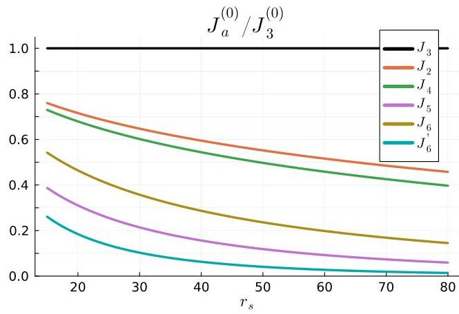

## Page 0

# Magnetic Interactions of Wigner Crystal in Magnetic Field and Berry Curvature: Multi-Particle Tunneling through Complex Trajectories 

Kyung-Su Kim* Department of Physics and Anthony J. Leggett Institute for Condensed Matter Theory, University of Illinois Urbana-Champaign, 1110 West Green Street, Urbana, Illinois 61801, USA

(Dated: August 19, 2025)

#### Abstract

We study how a weak perpendicular magnetic field $B$ and a Berry curvature $\Omega$ modify the magnetic interactions of a two-dimensional Wigner crystal (WC), using the semi-classical large- $r_{s}$ expansion. When only a magnetic field is present, various ring-exchange interactions arise from electron tunneling along complex trajectories, which constitute complex instanton solutions of the coordinate-space path integral. To leading order in $B$, each ring-exchange constant acquires an Aharonov-Bohm (AB) phase equal to the magnetic flux enclosed by the real tunneling trajectory of the $B=0$ problem. This effect is directly relevant to two-dimensional electron systems with a small $g$-factor $(g \ll 1)$. In the presence of a Berry curvature, multi-particle tunneling must be considered in a (complexified) phase space $(\mathbf{r}, \mathbf{k})$. To leading order in $\Omega$, the exchange constants acquire the Berry phase enclosed by a purely imaginary trajectory in a momentum space. Finally, when both $B$ and $\Omega$ are non-zero, in addition to having the AB and Berry phase factors, the magnitude of the exchange constant can also be renormalized by an effective-mass correction. These effects may be relevant for the WC and its proximate phases recently observed in tetra- and penta-layer rhombohedral graphene.

The two-dimensional electron gas (2DEG), a system of Coulomb-interacting electrons confined in two dimensions,

$$
H_{0}=\sum_{i} \frac{\mathbf{p}_{i}^{2}}{2 m}+\sum_{i<j} \frac{e^{2}}{4 \pi \epsilon} \frac{1}{\left|\mathbf{r}_{i}-\mathbf{r}_{j}\right|}
$$

is described by a dimensionless parameter characterizing the ratio of the interaction energy to the kinetic energy

$$
r_{s}=\frac{e^{2} / 8 \pi \epsilon r_{0}}{\hbar^{2} / 2 m r_{0}^{2}}=r_{0} / a_{\mathrm{B}}
$$

$r_{0}=1 / \sqrt{\pi n}$ is the average interparticle distance (for an electron density $n$ ) and $a_{\mathrm{B}}=4 \pi \epsilon \hbar^{2} / m e^{2}$ is the effective Bohr radius. The 2DEG forms a Fermi liquid (FL) in the weak-coupling regime $\left(r_{s} \ll 1\right)$ and a Wigner crystal (WC) in the strong-coupling regime $r_{s} \gg 1[1-4]$ [5].

The magnetism within each such phase of the 2DEG is an interesting and subtle problem that has attracted longstanding attention [2-4, 6, 7]. In particular, in the WC phase, the magnetism is determined by various multi-spin ring-exchange processes [8-15] (See Ref. [16] for the most recent investigation). The effective spin Hamiltonian is written as a sum over various ring-exchange interactions:

$$
\begin{aligned}
& H_{\mathrm{eff}}=-\sum_{a}(-1)^{P_{a}} J_{a} \hat{\mathcal{P}}_{a} \\
& =\sum_{\bullet \bullet}\left(J_{2} \hat{\mathcal{P}}_{2}+J_{2}^{*} \hat{\mathcal{P}}_{2}^{-1}\right)-\sum_{\bullet}\left(J_{3} \hat{\mathcal{P}}_{3}+J_{3}^{*} \hat{\mathcal{P}}_{3}^{-1}\right) \\
& +\sum_{\bullet \bullet}\left(J_{4} \hat{\mathcal{P}}_{4}+J_{4}^{*} \hat{\mathcal{P}}_{4}^{-1}\right)-\sum_{\bullet \bullet}\left(J_{5} \hat{\mathcal{P}}_{5}+J_{5}^{*} \hat{\mathcal{P}}_{5}^{-1}\right) \\
& +\sum_{\bullet \bullet}\left(J_{6} \hat{\mathcal{P}}_{6}+J_{6}^{*} \hat{\mathcal{P}}_{6}^{-1}\right)+\sum_{\bullet \bullet \bullet}\left(J_{6}^{\prime} \hat{\mathcal{P}}_{6}+J_{6}^{\prime *} \hat{\mathcal{P}}_{6}^{-1}\right)+\cdots
\end{aligned}
$$

[^0]where $P_{a}$ refers to an $n_{a}$-particle exchange that permutes spins in each polygon in (3) in a counter-clockwise direction and $(-1)^{P_{a}}=(-1)^{n_{a}+1}$ is the sign of the permutation. $\hat{\mathcal{P}}_{a}$ is the permutation operator for $P_{a}$, which could in turn be expressed in terms of $\mathbf{S}_{i}$ as in (25-28). $J_{a}$ is the exchange constant for $P_{a}$ that is in general complex when the magnetic field $(B)$ or Berry curvature $(\Omega)$ is present $\left(J_{a}^{*}\right.$ is the complex conjugate). When $B=\Omega=0$, the semi-classical large- $r_{s}$ approximation gives [11-13, 16]

$$
J_{a}(B=0, \Omega=0) \equiv J_{a}^{(0)}=\frac{e^{2}}{4 \pi \epsilon a_{\mathrm{B}}} \frac{A_{a}^{(0)}}{r_{s}^{3 / 4}} \sqrt{\frac{\tilde{S}_{a}^{(0)}}{2 \pi}} e^{-\sqrt{r_{s}} \tilde{S}_{a}^{(0)}}
$$

where $\tilde{S}_{a}^{(0)}$ and $A_{a}^{(0)}$ are, respectively, the (normalized) action and the fluctuation determinant shown in Table I.

How does the presence of a uniform out-of-plane magnetic field $B$ and a Berry curvature $\Omega$ affect these ringexchange interactions? We address this question in the 2DEG system in the presence of a uniform $B$ and/or $\Omega$, where the Berry curvature is thought to be derived from some parent band [17]. Throughout this paper, we consider a system with a small effective $g$ factor $(g \ll 1)$ and ignore the Zeeman splitting. We derive the formula for the exchange constants $J_{a}$ using the asymptotic large- $r_{s}$ expansion (i.e., deep in the WC phase) for three cases: (i) $B \neq 0$ and $\Omega=0$; (ii) $B=0$ and $\Omega \neq 0$; and (iii) $B \neq 0$ and $\Omega \neq 0$. We summarize our main results as follows.
(i) When only the (uniform) magnetic field is present, we solve the multi-particle tunneling problem in the large$r_{s}$ limit at a fixed "Landau-level filling factor"

$$
\nu \equiv n \cdot 2 \pi l_{B}^{2}=2\left(l_{B} / r_{0}\right)^{2}=O(1)
$$

where $l_{B} \equiv \sqrt{\hbar / e B}$ is the magnetic length. We assume $\nu$ to be of order 1 and use $\left(\nu \sqrt{r_{s}}\right)^{-1} \ll 1$ as a small expansion parameter [18]. To leading order, the exchange

[^0]:    * kyungsu@illinois.edu

## Page 1

| Process | $\tilde{S}_{a}^{(0)}$ | $A_{a}^{(0)}$ | $\tilde{\Sigma}_{a}^{(r)}$ | $\tilde{\Sigma}_{a}^{(k)}$ |
| --- | --- | --- | --- | --- |
| $J_{2}$ | 1.63 | 1.28 | 1.43 | -1.69 |
| $J_{3}$ | 1.53 | 1.18 | 3.03 | -0.73 |
| $J_{4}$ | 1.65 | 1.32 | 4.62 | -0.57 |
| $J_{5}$ | 1.90 | 1.72 | 6.22 | -0.53 |
| $J_{6}$ | 1.79 | 1.62 | 10.87 | -0.29 |
| $J_{6}^{\prime}$ | 2.11 | 2.48 | 7.79 | -0.48 |

TABLE I. $\tilde{S}_{a}^{(0)}$ : Dimensionless action; $A_{a}^{(0)}$ : fluctuation determinant; $\tilde{S}_{a}^{(0)}$ and $A_{a}^{(0)}$ enter (4); $\tilde{\Sigma}_{a}^{(r)}$ : dimensionless area enclosed by the real-space trajectory $\tilde{\mathbf{r}}^{(0)}(\tilde{\tau})$ (8); $\tilde{\Sigma}_{a}^{(k)}$ : dimensionless area enclosed by (imaginary) momentum-space trajectory $\tilde{\mathbf{k}}^{(0)}(\tilde{\tau})$ (13). These values are obtained from semi-classical trajectories—solutions to (50)—by discretizing the imaginary time into $N_{\text{time}}=50$ slices, with $N_{\text{move}}=30,40, \ldots, 90$ electrons allowed to move during the tunneling process, and then extrapolating to $N_{\text {move }} \rightarrow \infty$. The details on how the semiclassical trajectory is obtained can be found in Ref. [16].
constants in (3) are modified from their zero-field value by an Aharonov-Bohm phase factor $\phi_{a}(B)$ [19]:

$$
\begin{gathered}
J_{a}^{(0)} \rightarrow J_{a}(B)=J_{a}^{(0)} e^{i \phi_{a}(B)} \\
\phi_{a}(B)=-\frac{e B}{\hbar} \Sigma_{a}^{(r)}=-\frac{2}{\nu} \tilde{\Sigma}_{a}^{(r)} \\
\Sigma_{a}^{(r)} \equiv \sum_{i} \frac{1}{2} \int \mathbf{r}_{i, a}^{(0)} \times d \mathbf{r}_{i, a}^{(0)} \equiv r_{0}^{2} \cdot \tilde{\Sigma}_{a}^{(r)}
\end{gathered}
$$

Here, $\Sigma_{a}^{(r)}$ is the area enclosed by the position-space tunneling trajectory $\mathbf{r}_{a}^{(0)}(\tau) \equiv\left(\mathbf{r}_{1, a}^{(0)}(\tau), \cdots, \mathbf{r}_{N, a}^{(0)}(\tau)\right)$ in the absence of a magnetic field and is positive for counterclockwise motion. $\tilde{\Sigma}_{a}^{(r)}$ is the dimensionless area whose value (shown in Table I) is independent of $r_{s}$ and $\nu$.
(ii) In the case where only the (uniform) Berry curvature is present, we solve the problem at large $r_{s}$ for a fixed

$$
\alpha \equiv r_{s} \nu_{\Omega}=\frac{2 \Omega}{a_{B}^{2} r_{s}}=O(1)
$$

which is assumed to be of order 1. Here we defined the "Chern filling factor,"

$$
\nu_{\Omega} \equiv \Omega \cdot 2 \pi n=\operatorname{sgn}(\Omega) \cdot 2\left(l_{\Omega} / r_{0}\right)^{2}=O\left(1 / r_{s}\right)
$$

with the Berry length scale $l_{\Omega} \equiv \sqrt{|\Omega|}$. To leading order in $1 / r_{s}, J_{a}$ acquires a Berry phase $\gamma_{a}(\Omega)$ enclosed by the momentum-space tunneling trajectory $\mathbf{k}^{(0)}(\tau)$ at $\Omega=0$ :

$$
\begin{gathered}
J_{a}^{(0)} \rightarrow J_{a}(\Omega)=J_{a}^{(0)} e^{i \gamma_{a}(\Omega)} \\
\gamma_{a}(\Omega)=\Omega \cdot \Sigma_{a}^{(k)}=\frac{\alpha}{2} \tilde{\Sigma}_{a}^{(k)} \\
\Sigma_{a}^{(k)} \equiv \sum_{i} \frac{1}{2} \int \mathbf{k}_{i, a}^{(0)} \times d \mathbf{k}_{i, a}^{(0)} \\
=-\sum_{i} \frac{1}{2} \int \mathcal{I} m \mathbf{k}_{i, a}^{(0)} \times d \mathcal{I} m \mathbf{k}_{i, a}^{(0)} \equiv \frac{1}{a_{B} r_{0}} \tilde{\Sigma}_{a}^{(k)}
\end{gathered}
$$

Interestingly, since the momentum-space trajectory is purely imaginary at leading order, $\mathbf{k}^{(0)}=i \mathcal{I} m \mathbf{k}^{(0)}, \tilde{\Sigma}_{a}^{(k)}<$ 0 is negative for counter-clockwise motion in a position space. $\tilde{\Sigma}_{a}^{(k)}$ is again independent of $r_{s}$ and $\nu_{\Omega}$ (Table I).
(iii) Finally, when both $B$ and $\Omega$ are finite, the Aharonov-Bohm and Berry phases contribute additively

$$
J_{a}^{(0)} \rightarrow J_{a}(B, \Omega)=\left|J_{a}(B, \Omega)\right| e^{i\left[\phi_{a}(B)+\gamma_{a}(\Omega)\right]}
$$

with a possible modification of the magnitude of the exchange constant. This arises because the orbital magnetic moment that couples to the magnetic field

$$
\Delta H=-M_{z}(\mathbf{k}) B
$$

can renormalize the effective band mass,

$$
m \rightarrow m^{*}=\left.\left(\frac{1}{m}-\frac{B}{\hbar^{2}} \frac{d^{2} M_{z}}{d k^{2}}\right|_{\mathbf{k}=\mathbf{Q}_{0}}\right)^{-1}
$$

which in turn renormalizes $r_{s} \rightarrow r_{s}^{*}(2)$ and $a_{B} \rightarrow a_{B}^{*}$, and hence the tunneling rate

$$
J_{a}^{(0)} \rightarrow\left|J_{a}(B, \Omega)\right|=\frac{e^{2}}{4 \pi \epsilon a_{\mathrm{B}}^{*}} \cdot \frac{A_{a}^{(0)}}{r_{s}^{* 5 / 4}} \sqrt{\frac{S_{a}^{(0)}}{2 \pi}} e^{-\sqrt{r_{s}^{*}} \tilde{S}_{a}^{(0)}}
$$

Here, $\mathbf{Q}_{0}$ is the crystal momentum at the band bottom (which is assumed to be unique) and the effective mass tensor is taken to be isotropic for simplicity.

Effects of a magnetic field-We first derive the exchange interactions of the WC in the presence of a magnetic field,

$$
H=\sum_{i} \frac{\left[\mathbf{p}_{i}+e \mathbf{A}\left(\mathbf{r}_{i}\right)\right]^{2}}{2 m}+\sum_{i<j} \frac{e^{2}}{4 \pi \epsilon} \frac{1}{\left|\mathbf{r}_{i}-\mathbf{r}_{j}\right|}
$$

where $\mathbf{A}(\mathbf{r})=B(-y / 2, x / 2)$, closely following the analogous derivation for $B=0$ (see e.g., Refs. [12, 16]). For a moment, let us consider a single tunneling process $P_{a}$ that cyclically permutes $n_{a}$ electrons at WC sites $\mathbf{R}_{i_{k}}$ (with spins $\sigma_{k}$ ) to $\mathbf{R}_{i_{k+1}}\left(i_{n_{a}+1} \equiv i_{1}\right)$

$$
\left(\mathbf{R}_{i_{k}}, \sigma_{k}\right) \underset{P_{a}}{\rightarrow}\left(\mathbf{R}_{i_{k+1}}, \sigma_{k}\right), \quad k=1, \cdots, n_{a}
$$

The effective Hamiltonian matrix element describing this process is expressed as

$$
\left\langle P_{a} \boldsymbol{\sigma}\right| h_{a}|\boldsymbol{\sigma}\rangle=-J_{a}(B)
$$

where $\boldsymbol{\sigma} \equiv\left(\sigma_{1}, \sigma_{2}, \cdots, \sigma_{N}\right)$ is a spin configuration whose $i$ th component $\sigma_{i}$ is the spin at a WC site $\mathbf{R}_{i}$ and

$$
P_{a} \boldsymbol{\sigma} \equiv\left(\sigma_{P_{a}^{-1}(1)}, \sigma_{P_{a}^{-1}(2)}, \cdots, \sigma_{P_{a}^{-1}(N)}\right)
$$

is the permuted configuration.

$$
|\boldsymbol{\sigma}\rangle \equiv \mid\left(\mathbf{R}_{i}, \sigma_{i}\right)\rangle
$$

## Page 2

is a shorthand for a state where the site $\mathbf{R}_{i}$ is occupied by an electron with a spin $\sigma_{i}$. In terms of operators [20],

$$
\begin{aligned}
h_{a}= & -J_{a} \sum_{\left\{\sigma_{i}\right\}} f_{i_{2}, \sigma_{1}}^{\dagger} f_{i_{3}, \sigma_{2}}^{\dagger} \cdots f_{i_{1}, \sigma_{n_{a}}}^{\dagger} f_{i_{n_{a}}, \sigma_{n_{a}}} \cdots f_{i_{2}, \sigma_{2}} f_{i_{1}, \sigma_{1}} \\
= & -(-1)^{P_{a}} J_{a} \hat{\mathcal{P}}_{a} \\
& \hat{\mathcal{P}}_{a} \equiv \sum_{\left\{\sigma_{i}\right\}} f_{i_{n_{a}}, \sigma_{n_{a}-1}}^{\dagger} f_{i_{n_{a}}, \sigma_{n_{a}}} \cdots f_{i_{1}, \sigma_{n_{a}}}^{\dagger} f_{i_{1}, \sigma_{1}} \\
& =\hat{\mathcal{P}}_{i_{1} i_{2}} \hat{\mathcal{P}}_{i_{2} i_{3}} \cdots \hat{\mathcal{P}}_{i_{n_{a}-1} i_{n_{a}}}
\end{aligned}
$$

where $f_{i, \sigma}^{\dagger}$ and $f_{i, \sigma}$ are, respectively, the electron creation and annihilation operator at a WC site $\mathbf{R}_{i}$ with a spin $\sigma$. The sign factor $(-1)^{P_{a}}$ in (23) comes from reordering the fermionic operators. $\hat{\mathcal{P}}_{a}$ can in turn be expressed in terms of spin operators as

$$
\begin{aligned}
\hat{\mathcal{P}}_{i j} & =2 \mathbf{S}_{i} \cdot \mathbf{S}_{j}+\frac{1}{2} \\
\hat{\mathcal{P}}_{i j k} & =\mathbf{S}_{i} \cdot \mathbf{S}_{j}+\mathbf{S}_{j} \cdot \mathbf{S}_{k}+\mathbf{S}_{k} \cdot \mathbf{S}_{i}-2 i \chi_{i j k}+\frac{1}{4} \\
\chi_{i j k} & \equiv \mathbf{S}_{i} \cdot \mathbf{S}_{j} \times \mathbf{S}_{k} \\
\hat{\mathcal{P}}_{i j k l} & =\frac{1}{2}\left(\mathbf{S}_{i} \cdot \mathbf{S}_{j}+\cdots\right)-i\left(\chi_{i j k}+\chi_{j k l}+\chi_{k l i}+\chi_{l i j}\right) \\
& +2 h_{i j k l}+\frac{1}{8} \\
h_{i j k l} & \equiv\left(\mathbf{S}_{i} \cdot \mathbf{S}_{j}\right)\left(\mathbf{S}_{k} \cdot \mathbf{S}_{l}\right)+(j \leftrightarrow l)-(j \leftrightarrow k)
\end{aligned}
$$

etc. Here, the first term in $\hat{\mathcal{P}}_{i j k l}$ involves the sum over all Heisenberg couplings between any two spins in $i, j, k, l$ and $\chi_{i j k}$ is the spin-chirality operator. Summing over all $h_{a}$ (23), we recover the effective spin Hamiltonian (3).

The objective now is to obtain the expression for $J_{a}(B)$ in the $r_{s} \rightarrow \infty$ limit analogously as in the $B=0$ case [16]. This is done by first obtaining the asymptotic behavior of the off-diagonal and diagonal propagators at an intermediate time scale

$$
1 / E_{\text {Debye }} \ll \Delta \tau \ll 1 /\left|J_{a}\right|
$$

where $E_{\text {Debye }} \equiv e^{2} /\left(4 \pi \epsilon a_{\mathrm{B}} r_{s}^{3 / 2}\right)$ sets the zero-point energy scale (per particle) of the WC. By projecting to the Hilbert space spanned by classical ground-state manifold and expanding the exponential in Taylor series [21],

$$
\begin{aligned}
\langle\boldsymbol{\sigma}| e^{-\Delta \tau H}|\boldsymbol{\sigma}\rangle & \sim|\psi(\mathbf{R})|^{2} e^{-\beta E_{0}} \\
\left\langle P_{a} \boldsymbol{\sigma}\right| e^{-\Delta \tau H}|\boldsymbol{\sigma}\rangle & \sim|\psi(\mathbf{R})|^{2} e^{-\beta E_{0}} \Delta \tau J_{a}
\end{aligned}
$$

where $|\psi(\mathbf{R})|^{2}=\left|\psi\left(P_{a} \mathbf{R}\right)\right|^{2}$ is the probability density of electrons occupying the WC sites $\mathbf{R}$ and $E_{0}=c N E_{\text {Debye }}$ is the total zero-point energy of the system [ $c$ is some $O(1)$ number]. By taking the ratio of the two, we obtain

$$
J_{a} \sim \Delta \tau^{-1} \frac{\left\langle P_{a} \boldsymbol{\sigma}\right| e^{-\Delta \tau H}|\boldsymbol{\sigma}\rangle}{\langle\boldsymbol{\sigma}| e^{-\Delta \tau H}|\boldsymbol{\sigma}\rangle}
$$

The propagators on the right-hand side can in turn be represented as a path integral,

$$
\begin{aligned}
& \langle P \boldsymbol{\sigma}| e^{-\beta H}|\boldsymbol{\sigma}\rangle=\delta_{\boldsymbol{\sigma}, P \boldsymbol{\sigma}} \int_{\tilde{\mathbf{r}}(0)=\tilde{\mathbf{R}}}^{\tilde{\mathbf{r}}(\tilde{\tau})=P \tilde{\mathbf{R}}} D \tilde{\mathbf{r}}(\tilde{\tau}) e^{-\sqrt{r_{s}} \tilde{S}} \\
& \tilde{S}[\tilde{\mathbf{r}}(\tilde{\tau})]=\int_{0}^{\tilde{\beta}} d \tilde{\tau}\left[\sum_{i}\left\{\frac{\hat{\tilde{\mathbf{r}}}_{i}^{2}}{2}+i \frac{2}{\nu \sqrt{r_{s}}} \tilde{x}_{i} \dot{\tilde{y}}_{i}\right\}+V(\tilde{\mathbf{r}})-\tilde{V}_{0}\right] \\
& V(\tilde{\mathbf{r}}) \equiv \sum_{i<j} \frac{1}{\left|\tilde{\mathbf{r}}_{i}-\tilde{\mathbf{r}}_{j}\right|}
\end{aligned}
$$

Here, the action is rescaled to make the $r_{s}$ dependence manifest by introducing the dimensionless coordinates, $\tilde{\mathbf{r}} \equiv \mathbf{r} / r_{0}$, and the dimensionless imaginary time $\tilde{\tau}=\tau E_{\text {Debye }}$. The corresponding dimensionless inverse temperature is $\tilde{\beta} \equiv \beta E_{\text {Debye }}$. The $\delta_{\boldsymbol{\sigma}, P \boldsymbol{\sigma}}$ factor in the first line appears because each electron's spin is conserved under the dynamics of (18). $(P \mathbf{R})_{i} \equiv \mathbf{R}_{P(i)}$. The dot indicates a derivative with respect to $\tilde{\tau}$, e.g., $\dot{\tilde{x}}_{i} \equiv d \tilde{x}_{i} / d \tilde{\tau}$. $\nu$ is the Landau-level filling factor (5). The minimum (classical) Coulomb energy $\tilde{V}_{0}=\min _{\tilde{\mathbf{r}}} V(\tilde{\mathbf{r}})$ corresponding to the classical WC configuration is subtracted for convenience. The long-range Coulomb interaction $V$ is calculated using the standard Ewald method [22].

At large $r_{s}$, the dominant paths in the path integral (34) are given by small oscillations around the classical WC configurations together with instanton events that connect one WC configuration to another via multi-particle exchange processes. Since $1 / E_{\text {Debye }}$ is the typical size of instantons in imaginary time and $1 /\left|J_{a}\right|$ is the average distance between them, at most one instanton event can occur for the intermediate time scale $\Delta \tau$ (30). Therefore,

$$
J_{a} \sim \Delta \tau^{-1} \frac{\left.\left\langle P_{a} \boldsymbol{\sigma}\right| e^{-\Delta \tau H}|\boldsymbol{\sigma}\rangle\right|_{1 \text {-inst }}}{\langle\boldsymbol{\sigma}| e^{-\Delta \tau H}|\boldsymbol{\sigma}\rangle \mid 0 \text {-inst }}}
$$

The denominator is evaluated by considering small oscillation contributions around a WC configuration, $\tilde{\mathbf{r}}(\tilde{\tau})=$ $\tilde{\mathbf{R}}+\delta \tilde{\mathbf{r}}(\tilde{\tau})$. Noting that $S[\tilde{\mathbf{R}}]=0$,

$$
\begin{aligned}
& \langle\mathbf{R}| e^{-\Delta \tau H}|\mathbf{R}\rangle\left.\right|_{0 \text {-inst }} \sim\left[\operatorname{det}\left(\sqrt{r_{s}} \mathbf{M}[\tilde{\mathbf{R}}]\right)\right]^{-1 / 2} \\
& \equiv \int_{\delta \tilde{\mathbf{r}}(0)=\mathbf{0}}^{\delta \tilde{\mathbf{r}}(\Delta \tilde{\tau})=\mathbf{0}} D \delta \tilde{\mathbf{r}}(\tilde{\tau}) \exp \left(-\sqrt{r_{s}} \int d \tilde{\tau} \frac{1}{2} \delta \tilde{\mathbf{r}}(\tilde{\tau})^{T} \mathbf{M}[\tilde{\mathbf{R}}] \delta \tilde{\mathbf{r}}(\tilde{\tau})\right) \\
& M_{i j}[\tilde{\mathbf{R}}]\left.\equiv \frac{\delta^{2} \tilde{S}}{\delta \tilde{r}_{i}(\tilde{\tau}) \delta \tilde{r}_{j}(\tilde{\tau})}\right|_{\tilde{\mathbf{r}}(\tilde{\tau})=\tilde{\mathbf{R}}} \\
& =-\delta_{i j} \frac{\partial^{2}}{\partial \tilde{\tau}^{2}}+\frac{2 i}{\nu \sqrt{r_{s}}} \mathcal{E}_{i j} \frac{\partial}{\partial \tilde{\tau}}+\frac{\partial^{2} V}{\partial \tilde{r}_{i} \partial \tilde{r}_{j}}[\tilde{\mathbf{R}}] \\
& \mathcal{E} \equiv\left[\begin{array}{cccccc}
0 & 1 & & & \\
-1 & 0 & & & \\
& & \ddots & & \\
& & & 0 & 1 \\
& & & -1 & 0
\end{array}\right]
\end{aligned}
$$

## Page 3

The numerator of (37) is obtained from the semi-classical path $\tilde{\mathbf{r}}_{a}(\tilde{\tau})$ connecting $\tilde{\mathbf{R}}$ to $P\tilde{\mathbf{R}}$, together with harmonic fluctuations about it. Here $\tilde{\mathbf{r}}_{a}(\tilde{\tau})$ is the solution to the saddle-point equation of motion of the action (35),

$\frac{d^{2}\tilde{x}_{i}}{d\tilde{\tau}^{2}}-i\frac{2}{\nu \sqrt{r_{s}}} \frac{d\tilde{y}_{i}}{d\tilde{\tau}}-\partial_{\tilde{x}_{i}} V[\tilde{\mathbf{r}}(\tilde{\tau})]=0$
$\frac{d^{2} \tilde{y}_{i}}{d \tilde{\tau}^{2}}+i \frac{2}{\nu \sqrt{r_{s}}} \frac{d \tilde{x}_{i}}{d \tilde{\tau}}-\partial_{\tilde{y}_{i}} V[\tilde{\mathbf{r}}(\tilde{\tau})]=0$
satisfying the boundary condition

$$
\tilde{\mathbf{r}}_{a}(0)=\tilde{\mathbf{R}} \equiv \mathbf{R} / r_{0} \text { and } \tilde{\mathbf{r}}_{a}(\Delta \tilde{\tau})=P_{a} \tilde{\mathbf{R}} \equiv P_{a} \mathbf{R} / r_{0}
$$

Note that, when $B \neq 0$ (i.e., $1 / \nu \neq 0$ ), no real solution of the above instanton equations exists, forcing us to look for a complex solution. This amounts to a complex instanton saddle of the path integral. Defining $\tilde{S}_{a} \equiv \tilde{S}\left[\tilde{\mathbf{r}}_{a}(\tilde{\tau})\right]$,

$$
\begin{aligned}
& \left.\left\langle P_{a} \boldsymbol{\sigma}\right| e^{-\Delta \tau H}|\boldsymbol{\sigma}\right\rangle\left.\right|_{a, 1 \text {-inst }} \sim e^{-\sqrt{r_{s}} \tilde{S}_{a}} \times \\
& \int_{\delta \tilde{\mathbf{r}}(0)=\tilde{\mathbf{R}}}^{\delta \tilde{\mathbf{r}}(\Delta \tilde{\tau})=P \tilde{\mathbf{R}}} D \delta \tilde{\mathbf{r}}(\tilde{\tau}) \exp \left(-\frac{\sqrt{r_{s}}}{2} \int_{0}^{\tilde{\tau}} d \tilde{\tau} \delta \tilde{\mathbf{r}}(\tilde{\tau})^{T} \mathbf{M}\left[\tilde{\mathbf{r}}_{a}(\tilde{\tau})\right] \delta \tilde{\mathbf{r}}(\tilde{\tau})\right) \\
& =e^{-\sqrt{r_{s}} \tilde{S}_{a}}\left[\operatorname{det}\left(\sqrt{r_{s}} \mathbf{M}\left[\tilde{\mathbf{r}}_{a}(\tilde{\tau})\right]\right)\right]^{-1 / 2}
\end{aligned}
$$

However, this expression diverges due to a zero mode of $\mathbf{M}\left[\tilde{\mathbf{r}}_{a}(\tilde{\tau})\right]$ corresponding to the translation of instanton in an imaginary time: $\mathbf{M}\left[\tilde{\mathbf{r}}_{a}(\tilde{\tau})\right] \partial_{\tilde{\tau}} \tilde{\mathbf{r}}_{a}(\tilde{\tau})=0$. After properly regularizing this divergence $[16,23,24]$,

$$
\begin{aligned}
& \left.\left\langle P_{a} \mathbf{r}_{0}\right| e^{-\Delta \tau H}\left|\mathbf{r}_{0}\right\rangle\right|_{a, 1 \text {-inst }} \\
& =\Delta \tau \frac{e^{2}}{4 \pi \epsilon a_{\mathrm{B}} r_{s}^{3 / 2}} \sqrt{\frac{\tilde{S}_{a}}{2 \pi}} e^{-\sqrt{r_{s}} \tilde{S}_{a}}\left[\operatorname{det}^{\prime}\left(\sqrt{r_{s}} \mathbf{M}\left[\tilde{\mathbf{r}}_{a}(\tilde{\tau})\right]\right)\right]^{-\frac{1}{2}}
\end{aligned}
$$

where prime in the determinant indicates that the zero mode contribution is omitted. Using the identity,

$$
\left(\frac{\operatorname{det}^{\prime}\left(\sqrt{r_{s}} \mathbf{M}\left[\tilde{\mathbf{r}}_{a}(\tilde{\tau})\right]\right)}{\operatorname{det}\left(\sqrt{r_{s}} \mathbf{M}[\tilde{\mathbf{R}}]\right)}\right)^{-\frac{1}{2}}=r_{s}^{1 / 4}\left(\frac{\operatorname{det}^{\prime}\left(\mathbf{M}\left[\tilde{\mathbf{r}}_{a}(\tilde{\tau})\right]\right)}{\operatorname{det}(\mathbf{M}[\tilde{\mathbf{R}}])}\right)^{-\frac{1}{2}}
$$

we obtain

$$
\begin{aligned}
J_{a} & =\frac{e^{2}}{4 \pi \epsilon a_{\mathrm{B}}} \cdot \frac{A_{a}}{r_{s}^{5 / 4}} \sqrt{\frac{\tilde{S}_{a}}{2 \pi}} e^{-\sqrt{r_{s}} \tilde{S}_{a}} \\
A_{a} & =\left(\frac{\operatorname{det}^{\prime} \mathbf{M}\left[\tilde{\mathbf{r}}_{a}(\tilde{\tau})\right]}{\operatorname{det} \mathbf{M}[\tilde{\mathbf{R}}]}\right)^{-\frac{1}{2}}
\end{aligned}
$$

The effective Hamiltonian (3) is then obtained by summing over all the possible tunneling processes $P_{a}$ [25]

This expression for $J_{a}$ applies for any value of $B$ as long as the complex solutions of (41) and (42) are found (which is a complicated task). But since the real instanton solutions $\left[\equiv \tilde{\mathbf{r}}_{a}^{(0)}(\tilde{\tau})\right]$ for the $B=0$ problem were already obtained $[12,13,16]$, we would like to obtain a simplified
expression for $J_{a}$ by expanding $\tilde{\mathbf{r}}_{a}(\tilde{\tau})$ around the zero-field solution $\tilde{\mathbf{r}}_{a}^{(0)}(\tilde{\tau})$ in powers of $1 / \sqrt{r}_{s}$ :

$$
\tilde{\mathbf{r}}_{a}(\tilde{\tau})=\tilde{\mathbf{r}}_{a}^{(0)}(\tilde{\tau})+\frac{1}{\sqrt{r}_{s}} \delta \tilde{\mathbf{r}}_{a}^{(1)}(\tilde{\tau})+O\left(r_{s}^{-1}\right)
$$

By substituting this in $(41,42)$, we obtain the real instanton equation at zeroth order

$$
\frac{d^{2} \tilde{\mathbf{r}}_{a}^{(0)}}{d \tilde{\tau}^{2}}-\tilde{\nabla} V\left[\tilde{\mathbf{r}}_{a}^{(0)}(\tilde{\tau})\right]=0
$$

subject to $\tilde{\mathbf{r}}_{a}^{(0)}(0)=\tilde{\mathbf{R}} \equiv \mathbf{R} / r_{0}$ and $\tilde{\mathbf{r}}_{a}^{(0)}(\Delta \tilde{\tau})=P_{a} \tilde{\mathbf{R}} \equiv$ $P_{a} \mathbf{R} / r_{0}$. The first-order equation is

$$
\frac{d^{2} \delta \tilde{r}_{i, a}^{(1)}}{d \tilde{\tau}^{2}}-\left(\partial_{\tilde{r}_{i}} \partial_{\tilde{r}_{j}} V\left[\tilde{\mathbf{r}}_{a}^{(0)}(\tilde{\tau})\right]\right) \delta \tilde{r}_{a, j}^{(1)}=\frac{2 i}{\nu} \mathcal{E}_{i j} \frac{d \tilde{r}_{a, j}^{(0)}}{d \tilde{\tau}}
$$

with $\delta \tilde{\mathbf{r}}_{a}^{(1)}(0)=0$ and $\delta \tilde{\mathbf{r}}_{a}^{(1)}(\Delta \tilde{\tau})=0$, where the repeated indices are implicitly summed over. Since (51) is a secondorder differential equation for $\tilde{\mathbf{r}}_{a}^{(1)}(\tilde{\tau}) / i$ with real coefficients, $\tilde{\mathbf{r}}_{a}^{(1)}(\tilde{\tau})$ is purely imaginary.

We also expand the instanton action in powers of $r_{s}^{-1 / 2}$ :

$$
\begin{aligned}
\sqrt{r}_{s} \tilde{S}_{a} & =\sqrt{r}_{s} \int_{0}^{\Delta \tilde{\tau}} d \tilde{\tau}\left(\dot{\tilde{\mathbf{r}}}_{a}^{2}+\frac{i}{\nu \sqrt{r}_{s}} \tilde{\mathbf{r}}_{a}^{T} \mathcal{E} \dot{\tilde{\mathbf{r}}}_{a}\right) \\
& =\sqrt{r}_{s} \tilde{S}_{a}^{(0)}+i \frac{2}{\nu} \tilde{\Sigma}_{a}^{(r)}+O\left(1 / \sqrt{r}_{s}\right) \\
\tilde{S}_{a}^{(0)} & =\int_{0}^{\Delta \tilde{\tau}} d \tilde{\tau}\left(\dot{\tilde{\mathbf{r}}}_{a}^{(0)}\right)^{2}=\int d \tilde{r}_{a}^{(0)} \sqrt{2 V\left[\tilde{r}_{a}^{(0)}(\tilde{\tau})\right]} \\
\tilde{\Sigma}_{a}^{(r)} & \equiv \sum_{i} \frac{1}{2} \int \tilde{\mathbf{r}}_{i, a}^{(0)} \times d \tilde{\mathbf{r}}_{i, a}^{(0)}
\end{aligned}
$$

where $\tilde{S}_{a}^{(0)} \equiv \tilde{S}\left[\mathbf{r}_{a}^{(0)}(\tilde{\tau})\right]>0$ is the instanton action of the $B=0$ problem and $\tilde{\Sigma}_{a}$ is the signed area (positive for the counter-clockwise motion) enclosed by $\tilde{\mathbf{r}}_{a}^{(0)}(\tilde{\tau})$. The first line in (52) follows from the constant of motion of the zeroth-order instanton equation (50)

$$
\frac{1}{2}\left(\dot{\tilde{\mathbf{r}}}_{a}^{(0)}\right)^{2}-V\left[\tilde{\mathbf{r}}_{a}^{(0)}(\tilde{\tau})\right]+\tilde{V}_{0}=0
$$

In the second line of (52), we used the following identity

$$
\begin{aligned}
& \int d \tilde{\tau} \dot{\tilde{\mathbf{r}}}_{a}^{(0)}(\tilde{\tau}) \cdot \delta \dot{\tilde{\mathbf{r}}}_{a}^{(1)}(\tilde{\tau})=\int d \tilde{\tau} \nabla V\left[\tilde{\mathbf{r}}_{a}^{(0)}(\tilde{\tau})\right] \cdot \delta \dot{\tilde{\mathbf{r}}}_{a}^{(1)}(\tilde{\tau}) \\
& =\int d \tilde{\tau} \dot{\tilde{\mathbf{r}}}_{a}^{(0)} \cdot \delta \tilde{\mathbf{r}}_{a}^{(1)}=-\int d \tilde{\tau} \dot{\tilde{\mathbf{r}}}_{a}^{(0)} \cdot \delta \dot{\tilde{\mathbf{r}}}_{a}^{(1)}=0
\end{aligned}
$$

where the first equality follows from the constant of motion of the first-order instanton equation (51)

$$
\dot{\tilde{\mathbf{r}}}^{(0)} \cdot \delta \dot{\tilde{\mathbf{r}}}^{(1)}-\tilde{\nabla} V\left[\tilde{\mathbf{r}}^{(0)}(\tilde{\tau})\right] \cdot \delta \tilde{\mathbf{r}}^{(1)}=0
$$

the second equality follows from (50) and the third equality is obtained by integration by parts. This expression is zero since the first and the last expression is identical up to a minus sign.

## Page 4

Due to the imaginary deformation of the instanton path, the fluctuation determinant (48) also acquires a $O\left(r_{s}^{-1 / 2}\right)$ correction relative to its zero-field value:

$A_{a}=A_{a}^{(0)}+O\left(1 / \sqrt{r}_{s}\right),$
$A_{a}^{(0)} \equiv\left[\frac{\operatorname{det}^{\prime}\left(-\delta_{i j} \frac{\partial^{2}}{\partial \tilde{\tau}^{2}}+\frac{\partial^{2} V}{\partial \tilde{r}_{i} \partial \tilde{r}_{j}}\left[\tilde{\mathbf{r}}_{a}^{(0)}(\tilde{\tau})\right]\right)}{\operatorname{det}\left(-\delta_{i j} \frac{\partial^{2}}{\partial \tilde{\tau}^{2}}+\frac{\partial^{2} V}{\partial \tilde{r}_{i} \partial \tilde{r}_{j}}[\tilde{\mathbf{R}}]\right)}\right]^{-\frac{1}{2}} . \quad$ (59)

Collecting the leading contributions, we recover (6-8):

$$
J_{a}(B)=J_{a}^{(0)} \exp \left[-\frac{2 i}{\nu} \tilde{\Sigma}_{a}^{(r)}\right]
$$

where $J_{a}^{(0)}>0$ is the exchange constant at $B=0$

$$
J_{a}^{(0)}=\frac{e^{2}}{4 \pi \epsilon a_{\mathrm{B}}} \cdot \frac{A_{a}^{(0)}}{r_{s}^{5 / 4}} \sqrt{\frac{\tilde{S}_{a}^{(0)}}{2 \pi}} e^{-\sqrt{r_{s}} \tilde{S}_{a}^{(0)}}
$$

The values of $\tilde{S}_{a}^{(0)}, A_{a}^{(0)}$ and $\Sigma_{a}^{(0)}$ are numerically calculated and shown in Table I.

Effects of a Berry curvature-The previous result in a magnetic field (60-61) can be straightforwardly generalized to include the (uniform) Berry curvature effect. The Berry curvature effect on the real-time dynamics can be captured by considering a (phase-space) action $S_{M}=\int d t L_{M}$, where [26, 27] [28]

$$
\begin{aligned}
L_{M}=\sum_{i} & {\left[\hbar \mathbf{k}_{i} \cdot \frac{d \mathbf{r}_{i}}{d t}-\varepsilon_{M}\left(\mathbf{k}_{i}\right)-e \frac{d \mathbf{r}_{i}}{d t} \cdot \mathbf{A}\left(\mathbf{r}_{i}\right)\right.} \\
& \left.+\frac{d \mathbf{k}_{i}}{d t} \cdot \boldsymbol{\mathcal { A }}\left(\mathbf{k}_{i}\right)\right]-\sum_{i<j} \frac{e^{2}}{4 \pi \epsilon} \frac{1}{\left|\mathbf{r}_{i}-\mathbf{r}_{j}\right|}+V_{0}
\end{aligned}
$$

Here, $\mathbf{A}(\mathbf{r})=B(-y / 2, x / 2)$ and $\boldsymbol{\mathcal { A }}(\mathbf{k})=\Omega\left(-k_{y} / 2, k_{x} / 2\right)$, and as in (35), the minimum classical Coulomb energy $V_{0}=\frac{e^{2}}{4 \pi \epsilon r_{0}} V_{0}$ is subtracted from the Coulomb energy for convenience. $\varepsilon_{M}(\mathbf{k})=\frac{\hbar^{2} k^{2}}{2 m}-B M_{z}\left(\mathbf{k}+\mathbf{Q}_{0}\right)$ is the modified single-electron energy due to the orbital magnetic moment $M_{z}$, where $\mathbf{Q}_{0}$ is the momentum at the band bottom. Within a continuum approximation near $\mathbf{k} \sim \mathbf{Q}_{0}$, this amounts to renormalizing the effective mass $m \rightarrow m^{*}$ through (16) with a constant shift in energy [29]:

$$
\varepsilon_{M}(\mathbf{k}) \approx \frac{\hbar^{2} k^{2}}{2 m^{*}}-M_{z}\left(\mathbf{Q}_{0}\right) B
$$

We will drop the constant term $-M_{z}\left(\mathbf{Q}_{0}\right) B$ as it does not affect the spin physics when the band minimum occurs at a single valley [30].

Since we are interested in the thermodynamic properties (governed by the imaginary-time dynamics), we consider the Euclidean action $S_{E}$ upon Wick rotation

$$
\begin{aligned}
& S_{E}=\int d \tau\left(\sum_{i}\left[-i \mathbf{k}_{i} \cdot \frac{d \mathbf{r}_{i}}{d \tau}+\frac{\hbar^{2} k_{i}^{2}}{2 m^{*}}+i e \frac{d \mathbf{r}_{i}}{d \tau} \cdot \mathbf{A}\left(\mathbf{r}_{i}\right)\right.\right. \\
& \left.\left.-i \frac{d \mathbf{k}_{i}}{d \tau} \cdot \boldsymbol{\mathcal { A }}\left(\mathbf{k}_{i}\right)\right]+\sum_{i<j} \frac{e^{2}}{4 \pi \epsilon} \frac{1}{\left|\mathbf{r}_{i}-\mathbf{r}_{j}\right|}-V_{0}\right) \equiv \sqrt{r}_{s} \tilde{S}
\end{aligned}
$$

$$
\begin{aligned}
\tilde{S}=\int d \tilde{\tau}\left(\sum_{i}\right. & {\left[-i \tilde{\mathbf{k}}_{i} \cdot \dot{\tilde{\mathbf{r}}}_{i}+\frac{1}{2} \tilde{k}_{i}^{2}+\frac{i}{\nu \sqrt{r}_{s}} \tilde{\mathbf{r}}_{i} \times \dot{\tilde{\mathbf{r}}}_{i}\right.} \\
& \left.\left.-\frac{i \alpha}{4 \sqrt{r}_{s}} \tilde{\mathbf{k}}_{i} \times \dot{\tilde{\mathbf{k}}}_{i}\right]+V(\tilde{\mathbf{r}})-\tilde{V}_{0}\right)
\end{aligned}
$$

Again, in order to see the $r_{s}$ dependence manifest, we introduced the normalized action $\tilde{S}$ in terms of dimensionless coordinates [as defined below (34-36)] and momenta $\tilde{\mathbf{k}} \equiv \sqrt{a_{B} r_{0}} \mathbf{k}=r_{0} \mathbf{k} / \sqrt{r}_{s} . \alpha \equiv \nu_{\Omega} r_{s}=2 \Omega /\left(a_{B}^{2} r_{s}\right)$ is an $O(1)$ parameter (9) introduced to capture the Berry phase effect, where $\nu_{\Omega} \equiv \Omega \cdot 2 \pi n(10)$ is the Chern filling factor (analogous to the Landau-level filling factor $\nu$ ).

With this setup, the exchange constants $J_{a}(B, \Omega)$ can be derived analogously, but with key modifications, from the large- $r_{s}$ expansion. The saddle-point equations of the action (65) yield $4 N$ first-order Hamilton's equations for the (complex) phase-space variables $(\tilde{\mathbf{r}}, \tilde{\mathbf{k}})$ :

$$
\begin{aligned}
& \dot{\tilde{\mathbf{r}}}=-i \tilde{\mathbf{k}}-\frac{\alpha}{2 \sqrt{r}_{s}} \mathcal{E} \dot{\tilde{\mathbf{k}}} \\
& \dot{\tilde{\mathbf{k}}}=i \nabla_{\tilde{\mathbf{r}}} V-\frac{2}{\nu \sqrt{r}_{s}} \mathcal{E} \dot{\tilde{\mathbf{r}}}
\end{aligned}
$$

which result in

$$
\left(1+\frac{\alpha}{\nu r_{s}}\right) \ddot{\tilde{\mathbf{r}}}-\frac{2 i}{\nu \sqrt{r}_{s}} \mathcal{E} \dot{\tilde{\mathbf{r}}}+\frac{i \alpha}{2 \sqrt{r}_{s}} \mathcal{E} \nabla \nabla V[\tilde{\mathbf{r}}] \dot{\tilde{\mathbf{r}}}-\nabla V[\tilde{\mathbf{r}}]=0
$$

where $\nabla \nabla V[\tilde{r}]$ is the Hessian matrix of $V$ at $\tilde{\tau}$. These equations can be solved perturbatively in powers of $1 / \sqrt{r}_{s}$ :

$$
\begin{aligned}
& \tilde{\mathbf{r}}_{a}(\tilde{\tau})=\tilde{\mathbf{r}}_{a}^{(0)}(\tilde{\tau})+\frac{1}{\sqrt{r}_{s}} \delta \tilde{\mathbf{r}}_{a}^{(1)}(\tilde{\tau})+O\left(r_{s}^{-1}\right) \\
& \tilde{\mathbf{k}}_{a}(\tilde{\tau})=\tilde{\mathbf{k}}_{a}^{(0)}(\tilde{\tau})+\frac{1}{\sqrt{r}_{s}} \delta \tilde{\mathbf{k}}_{a}^{(1)}(\tilde{\tau})+O\left(r_{s}^{-1}\right)
\end{aligned}
$$

The zeroth-order term for $\tilde{\mathbf{r}}_{a}(\tilde{\tau})$ again satisfies the zerofield and zero-Berry-curvature instanton equation (50) whereas the first-order equation is modified to

$$
\delta \tilde{\mathbf{r}}_{a}^{(1)}-\nabla \nabla V\left[\tilde{\mathbf{r}}_{a}^{(0)}(\tilde{\tau})\right] \delta \tilde{\mathbf{r}}_{a}^{(1)}=\frac{2 i}{\nu} \mathcal{E} \tilde{\mathbf{r}}_{a}^{(0)}-\frac{i \alpha}{2} \mathcal{E} \tilde{\mathbf{r}}_{a}^{\prime(0)}
$$

Again, whereas $\tilde{\mathbf{r}}_{a}^{(0)}$ is real, $\delta \tilde{\mathbf{r}}_{a}^{(1)}$ is purely imaginary since the right-hand side of (71) is purely imaginary. On the other hand, the zeroth-order term for $\tilde{\mathbf{k}}_{a}$ is purely imaginary and the first-order correction is purely real

$$
\begin{aligned}
\tilde{\mathbf{k}}_{a}^{(0)}(\tilde{\tau}) & =i \dot{\tilde{\mathbf{r}}}_{a}^{(0)}(\tilde{\tau}) \\
\delta \tilde{\mathbf{k}}^{(1)}(\tilde{\tau}) & =i \delta \dot{\tilde{\mathbf{r}}}_{a}^{(1)}(\tilde{\tau})-\frac{\alpha}{2} \mathcal{E} \nabla V\left[\tilde{\mathbf{r}}^{(0)}(\tilde{\tau})\right]
\end{aligned}
$$

With the solutions to these equations, the expression for the tunneling action follows straightforwardly from the procedure analogous the one outlined below (52-54):

$$
\begin{aligned}
\sqrt{r}_{s} \tilde{S}_{a} & =\sqrt{r}_{s} \tilde{S}_{a}^{(0)}+i\left(\frac{2}{\nu} \tilde{\Sigma}_{a}^{(r)}-\frac{\alpha}{2} \tilde{\Sigma}_{a}^{(k)}\right)+O\left(r_{s}^{-\frac{1}{2}}\right) \\
\tilde{\Sigma}_{a}^{(k)} & \equiv \sum_{i} \frac{1}{2} \int \tilde{\mathbf{k}}_{i, a}^{(0)} \times d \tilde{\mathbf{k}}_{i, a}^{(0)}
\end{aligned}
$$

## Page 5

FIG. 1. Magnitude of exchange constants $J_{a}^{(0)}$ normalized by the largest one $J_{3}^{(0)}$ as a function of $15 \leq r_{s} \leq 80$. $J_{a}^{(0)}$ is obtained from (4) with $\tilde{S}_{a}^{(0)}$ and $\tilde{A}_{a}^{(0)}$ taken from Table I.

with $\tilde{S}_{a}^{(0)}$ and $\tilde{\Sigma}_{a}^{(r)}$ given by (53) and (54). The fluctuation determinant similarly acquires only a subdominant $O\left(1 / \sqrt{r}_{s}\right)$ correction which we ignore. Therefore,

$$
J_{a}(B, \Omega)=\left|J_{a}(B, \Omega)\right| \exp \left[i\left(-\frac{2}{\nu} \tilde{\Sigma}_{a}^{(r)}+\frac{\alpha}{2} \tilde{\Sigma}_{a}^{(k)}\right)\right]
$$

where the expression for the magnitude $\left|J_{a}(B, \Omega)\right|$ is given in (17) and is obtained from (61) by substituting $m \rightarrow m^{*}$ [see the relevant discussions below (62)].

Discussion-We analyzed how a magnetic field $(B)$ and a Berry curvature $(\Omega)$ modify the magnetism of a Wigner crystal (WC) through an asymptotic large- $r_{s}$ expansion. When either $B$ or $\Omega$ is present individually, the effect is simply to multiply the zero-field and zero-Berry-curvature exchange constant $J_{a}^{(0)}$ by a phase factor: the Aharonov-Bohm phase $\phi_{a}(B)$ for $B \neq 0(6-8)$ and the Berry phase $\gamma_{a}(\Omega)$ for $\Omega \neq 0(11-13)$. When both $B$ and $\Omega$ are present, in addition to having both phases, the magnitude of the exchange constant is also modified due to an effective mass renormalization originating from the coupling of the orbital magnetic moment to the magnetic field (15-17).

In the absence of a magnetic field or Berry curvature, the WC is thought to occur for $r_{s} \gtrsim 31$ [4], aside from the subtleties of possible intermediate phases [16, 31-33]. This critical value of $r_{s}$ will in general be shifted when $B$ or $\Omega$ is finite (as a function of dimensionless parameters $\nu$ and $\alpha$ ). Fig. 1 shows the relative magnitudes of exchange constants $J_{a}^{(0)}$ compared to the largest one $J_{3}^{(0)}$ over a physically relevant regime, e.g., $15 \leq r_{s} \leq 80$. In this range, at least four processes $\left(J_{3}, J_{2}, J_{4}, J_{6}\right)$ are appreciable, giving rise to a highly frustrated generalized

Heisenberg model. To the best of our knowledge, the phase diagram of this $J_{2}-J_{3}-J_{4}-J_{6}$ Hamiltonian in the presence of the Aharonov-Bohm (7) and/or Berry phase (12) has not been systematically investigated (even without the $J_{6}$ term). In contrast, the simpler $J_{2}-J_{3}-J_{4}$ model at $B=\Omega=0$ (i.e., $\phi_{a}=\gamma_{a}=0$ ) has been studied in [3438]. A further truncation to only $J_{2}$ and $J_{3}$ interactions yields a nearest-neighbor Heisenberg model supplemented by a spin-chirality term, which was studied in [39, 40],

$$
\begin{aligned}
H_{\text {eff }} \approx & 4\left(\left|J_{2}\right| \cos \Phi_{2}-\left|J_{3}\right| \cos \Phi_{3}\right) \sum_{\langle i, j\rangle} \mathbf{S}_{i} \cdot \mathbf{S}_{j} \\
& -4\left|J_{3}\right| \sin \Phi_{3} \sum_{\langle i, j, k\rangle \in \triangle} \mathbf{S}_{i} \cdot \mathbf{S}_{j} \times \mathbf{S}_{k}+\ldots \\
\Phi_{a}(\nu, \alpha) & \equiv-\frac{2}{\nu} \tilde{\Sigma}_{a}^{(r)}+\frac{\alpha}{2} \tilde{\Sigma}_{a}^{(k)}
\end{aligned}
$$

Here, $\left|J_{a}\right|$ is given by (4) [or by (17) when both $B \neq 0$ and $\Omega \neq 0$ ]. Interestingly, both the spin-chirality term $\chi_{i j k}$ and the four-spin term $h_{i j k l}$ (29) are shown to stabilize the Kalmeyer-Laughlin chiral spin liquid (CSL) phase [37, 39, 40]. Since both interactions appear in our effective Hamiltonian, the CSL phase could be realized over a broader region of the parameter space.

Recently, an extended region of the WC phase has been observed in tetra- and penta-layer rhombohedral graphene systems [41], suggesting that our considerations may be directly relevant to the WC and proximate correlated phases in this system. More broadly, the present results highlight that geometric phases manifest in a fundamentally different manner in correlated electron crystals compared to weakly interacting systems or Hubbard-type lattice models.

Note Added: Upon completion of this work, a preprint [42] appeared that partially overlaps with this work. The results are largely in agreement where they overlap.

## ACKNOWLEDGMENT

I am grateful to Pavel Nosov for insightful discussions that motivated this investigation, and to Steven A. Kivelson, Liang Fu, Michael Stone, Long Ju, and especially Eduardo Fradkin for valuable discussions. This work also benefited from discussions with participants of the Joint ICTP-WE Heraeus School and Workshop on Advances on Quantum Matter, my travel to which was partially supported by the US National Science Foundation (NSF) Grant Number 2201516 under the Accelnet program of Office of International Science and Engineering (OISE). I am supported by the Anthony J. Leggett Postdoctoral Fellowship at the University of Illinois Urbana-Champaign.

[1] E. Wigner, On the interaction of electrons in metals, Physical Review 46, 1002 (1934).
[2] B. Tanatar and D. M. Ceperley, Ground state of the twodimensional electron gas, Physical Review B 39, 5005

### Images

## Page 6

(1989).
[3] C. Attaccalite, S. Moroni, P. Gori-Giorgi, and G. B. Bachelet, Correlation energy and spin polarization in the 2D electron gas, Physical Review Letters 88, 256601 (2002).
[4] N. Drummond and R. Needs, Phase diagram of the lowdensity two-dimensional homogeneous electron gas, Physical Review Letters 102, 126402 (2009).
[5] There is an ongoing debate on the intermediate phases of the 2DEG, with various proposals ranging from (1) "microemulsion" phases where mesoscale WC and FL regions form bubbles and/or stripes [31, 32, 43] to (2) the metallic electron crystal phase where itinerant defects of the WC form a metallic state $[16,33]$.
[6] M. S. Hossain, M. Ma, K. V. Rosales, Y. Chung, L. Pfeiffer, K. West, K. Baldwin, and M. Shayegan, Observation of spontaneous ferromagnetism in a two-dimensional electron system, Proceedings of the National Academy of Sciences 117, 32244 (2020).
[7] K.-S. Kim and S. A. Kivelson, Discovery of an insulating ferromagnetic phase of electrons in two dimensions, Proceedings of the National Academy of Sciences 118, e2023964118 (2021).
[8] D. Thouless, Exchange in solid ${ }^{3} \mathrm{He}$ and the Heisenberg Hamiltonian, Proceedings of the Physical Society (19581967) 86, 893 (1965).
[9] M. Roger, J. Hetherington, and J. Delrieu, Magnetism in solid ${ }^{3} \mathrm{He}$, Reviews of Modern Physics 55, 1 (1983).
[10] M. Roger, Multiple exchange in ${ }^{3} \mathrm{He}$ and in the Wigner solid, Physical Review B 30, 6432 (1984).
[11] S. Chakravarty, S. Kivelson, C. Nayak, and K. Voelker, Wigner glass, spin liquids and the metal-insulator transition, Philosophical Magazine B 79, 859 (1999).
[12] K. Voelker and S. Chakravarty, Multiparticle ring exchange in the Wigner glass and its possible relevance to strongly interacting two-dimensional electron systems in the presence of disorder, Physical Review B 64, 235125 (2001).
[13] M. Katano and D. S. Hirashima, Multiple-spin exchange in a two-dimensional Wigner crystal, Physical Review B 62, 2573 (2000).
[14] K.-S. Kim, C. Murthy, A. Pandey, and S. A. Kivelson, Interstitial-induced ferromagnetism in a two-dimensional Wigner crystal, Physical Review Letters 129, 227202 (2022).
[15] B. Bernu, L. Cándido, and D. M. Ceperley, Exchange Frequencies in the 2D Wigner Crystal, Physical Review Letters 86, 870 (2001).
[16] K.-S. Kim, I. Esterlis, C. Murthy, and S. A. Kivelson, Dynamical defects in a two-dimensional Wigner crystal: self-doping and kinetic magnetism, Physical Review B 109, 235130 (2024).
[17] The uniformity is the Berry curvature is justified in the dilute filling of such a parent band within the effective mass approximation.
[18] Our main results are perturbative in $\left(\nu \sqrt{r}_{s}\right)^{-1}$ and therefore break down once the magnetic field becomes so strong that $\nu \sqrt{r}_{s} \lesssim 1$. In contrast, when $\nu r_{s} \ll 1$ and $\nu \ll 1$, the system is effectively at a dilute filling of the lowest Landau level (LLL), with the Coulomb interaction projected to the LLL. In this case, a different semi-classical expansion is possible by using $\nu$ as a small expansion parameter [44]. We also note that $\nu$ here should not be interpreted literally as a Landau-level filling factor, since we work in
the limit where the Coulomb interaction is the dominant energy scale and the Landau-level mixing is substantial.
[19] The existence of the Aharonov-Bohm phase in a magnetic field was suggested previously in [45, 46]. However, the theoretical analysis in [46] did not consider a complexified path integral needed to obtain the correct asymptotic expression of the exchange constants. In our approach, the tunneling trajectory is determined by solving the complex instanton equations of motion (41) and (42). As a result, while the leading-order expression (i.e., the phase factor) in [46] coincides with ours, their subleading corrections are not valid.
[20] The $f$ operators in the first line are 'normal-ordered' such that electrons with spins $\sigma_{1}, \sigma_{2}, \cdots, \sigma_{n_{a}}$ are annihilated in order and then created in a reverse order. For a more detailed discussion, see relevant discussions, e.g., in [47, 48].
[21] Here, the tilde denotes that the left-hand side is asymptotically equivalent to the right-hand side for $1 / E_{\text {Debye }} \ll$ $\Delta \tau \ll 1 /\left|J_{a}\right|$.
[22] As usual, it is assumed that a uniform neutralizing positively-charged background is present, which cancels the diverging contribution in (36).
[23] S. Coleman, Aspects of symmetry: selected Erice lectures, Cambridge University Press (1988).
[24] J. Zinn-Justin, Quantum field theory and critical phenomena, Oxford University Press (2021).
[25] Summing over multi-instanton configurations with distinct instanton events $a$ in the zero-temperature limit $[\beta \gg$ $1 /\left|J_{a}\right|$, as opposed to the intermediate time scale (30)] requires one to first divide $\tilde{\beta}=\beta E_{\text {Debye }}$ into $M$ slices, $\tilde{\beta}=M \Delta \tilde{\tau}$, where $\Delta \tau \equiv \Delta \tilde{\tau} / E_{\text {Debye }}$ satisfies (30), and then take $M \rightarrow \infty$ limit. For a more detailed treatment of this subtle derivation, we refer the readers to [12].
[26] D. Xiao, M.-C. Chang, and Q. Niu, Berry phase effects on electronic properties, Reviews of Modern Physics 82, 1959 (2010).
[27] M.-C. Chang and Q. Niu, Berry phase, hyperorbits, and the hofstadter spectrum: Semiclassical dynamics in magnetic bloch bands, Physical Review B 53, 7010 (1996).
[28] In order to faithfully capture the Berry curvature effect within the Hamiltonian approach (instead of the Lagrangian approach), one needs to include at least two bands as in $[49,50]$. This is not necessary for our purpose as we work with the effective continuum theory within the effective mass approximation.
[29] The details of how the effective mass renormalizes depend on the parent band structure and are not explored here. We treat $m^{*}$ (or $M_{z}$ ) as a given parameter in this work.
[30] When there are multiple valleys with different orbital magnetic moments, $-M_{z}(\mathbf{k}) B$ acts as a Zeeman-like term for valley degrees of freedom and must be included. Relatedly, a trigonal warping correction to the otherwise isotropic dispersion $\mathbf{p}^{2} / 2 m$ is shown to lead to a valley polarization of the WC even without this Zeeman-like coupling of the orbital magnetic moment to the magnetic field [51].
[31] R. Jamei, S. Kivelson, and B. Spivak, Universal aspects of Coulomb-frustrated phase separation, Physical Review Letters 94, 056805 (2005).
[32] B. Spivak and S. A. Kivelson, Transport in two dimensional electronic micro-emulsions, Annals of Physics 321, 2071 (2006).

## Page 7

[33] H. Falakshahi and X. Waintal, Hybrid phase at the quantum melting of the Wigner crystal, Physical Review Letters 94, 046801 (2005).
[34] K. Kubo and T. Momoi, Ground state of a spin system with two-and four-spin exchange interactions on the triangular lattice, Zeitschrift für Physik B Condensed Matter 103, 485 (1997).
[35] T. Momoi, K. Kubo, and K. Niki, Possible chiral phase transition in two-dimensional solid ${ }^{3} \mathrm{He}$, Physical review letters 79, 2081 (1997).
[36] O. I. Motrunich, Variational study of triangular lattice spin- $\frac{1}{2}$ model with ring exchanges and spin liquid state in $\kappa$-(ET) $)_{2} \mathrm{Cu}_{2}(\mathrm{CN})_{3}$, Physical Review B-Condensed Matter and Materials Physics 72, 045105 (2005).
[37] T. Cookmeyer, J. Motruk, and J. E. Moore, Four-spin terms and the origin of the chiral spin liquid in mott insulators on the triangular lattice, Physical Review Letters 127, 087201 (2021).
[38] G. Misguich, C. Lhuillier, B. Bernu, and C. Waldtmann, Spin-liquid phase of the multiple-spin exchange hamiltonian on the triangular lattice, Physical Review B 60, 1064 (1999).
[39] A. Wietek and A. M. Läuchli, Chiral spin liquid and quantum criticality in extended $S=\frac{1}{2}$ Heisenberg models on the triangular lattice, Physical Review B 95, 035141 (2017).
[40] S.-S. Gong, W. Zhu, J.-X. Zhu, D. N. Sheng, and K. Yang, Global phase diagram and quantum spin liquids in a spin- $\frac{1}{2}$ triangular antiferromagnet, Physical Review B 96, 075116 (2017).
[41] Z. Lu, T. Han, Y. Yao, Z. Hadjri, J. Yang, J. Seo, L. Shi, S. Ye, K. Watanabe, T. Taniguchi, et al., Extended quan-
tum anomalous Hall states in graphene/hBN moiré superlattices, Nature 637, 1090 (2025).
[42] S. Joy, L. Levitov, and B. Skinner, Chiral wigner crystal phases induced by berry curvature, arXiv preprint arXiv:2507.22121 (2025).
[43] J. Sung, J. Wang, I. Esterlis, P. A. Volkov, G. Scuri, Y. Zhou, E. Brutschea, T. Taniguchi, K. Watanabe, Y. Yang, et al., An electronic microemulsion phase emerging from a quantum crystal-to-liquid transition, Nature Physics (2025).
[44] J. Jain and S. Kivelson, Model tunneling problems in a high magnetic field, Physical Review B 37, 4111 (1988).
[45] T. Okamoto and S. Kawaji, Magnetism in a Wigner solid and the Aharonov-Bohm effect: Experiment and theory, Physical Review B 57, 9097 (1998).
[46] D. Hirashima and K. Kubo, Multiple-spin exchange in a two-dimensional Wigner crystal in a magnetic field, Physical Review B 63, 125340 (2001).
[47] K.-S. Kim and V. Elser, Itinerant Ferromagnetism from One-Dimensional Mobility, arXiv preprint arXiv:2412.03638 (2024).
[48] J. J. Sakurai and J. Napolitano, Modern quantum mechanics, Cambridge University Press (2020).
[49] T. Tan and T. Devakul, Parent Berry curvature and the ideal anomalous Hall crystal, Physical Review X 14, 041040 (2024).
[50] T. Soejima, J. Dong, A. Vishwanath, and D. E. Parker, A Jellium Model for the Anomalous Hall Crystal, arXiv preprint arXiv:2503.12704 (2025).
[51] V. Calvera, S. A. Kivelson, and E. Berg, Pseudo-spin order of Wigner crystals in multi-valley electron gases, Low Temperature Physics 49, 679 (2023).

