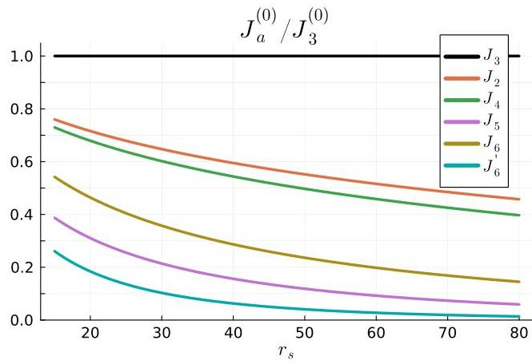

## Page 0

# How Magnetic Fields and Berry Curvature Affect Wigner Crystals: Multi-Particle Tunneling Through Complex Paths

Kyung-Su Kim*<br>Department of Physics and Anthony J. Leggett Institute for Condensed Matter Theory, University of Illinois Urbana-Champaign, 1110 West Green Street, Urbana, Illinois 61801, USA

(Dated: August 19, 2025)

#### Abstract

We investigate how a weak magnetic field ($B$) pointing straight up and a property called Berry curvature ($\Omega$) change the magnetic interactions within a two-dimensional Wigner crystal (WC). We use a method called semi-classical large-$r_s$ expansion. When only a magnetic field is present, different types of "ring-exchange" interactions appear. These happen because electrons tunnel along complicated paths, which are like "complex instanton solutions" in a mathematical description of their movement. For small magnetic fields, each ring-exchange interaction gets an extra "Aharonov-Bohm (AB) phase." This phase is equal to the magnetic flux that passes through the actual tunneling path that would exist if there were no magnetic field. This finding is important for two-dimensional electron systems where the $g$-factor (a measure of how strongly electrons respond to a magnetic field) is very small ($g \ll 1$).

When Berry curvature is present, the tunneling of multiple particles needs to be considered in a more complex mathematical space that includes both position ($\mathbf{r}$) and momentum ($\mathbf{k}$). For small Berry curvature, the exchange interactions get a "Berry phase." This phase comes from a purely imaginary path in momentum space. Finally, when both the magnetic field ($B$) and Berry curvature ($\Omega$) are present, the exchange interactions not only have the AB and Berry phase factors, but their strength can also change due to an "effective-mass correction." These effects might be important for Wigner crystals and similar states recently observed in certain types of graphene (tetra- and penta-layer rhombohedral graphene).

The two-dimensional electron gas (2DEG) is a system where electrons interact with each other and are confined to move in two dimensions.

$$
H_{0}=\sum_{i} \frac{\mathbf{p}_{i}^{2}}{2 m}+\sum_{i<j} \frac{e^{2}}{4 \pi \epsilon} \frac{1}{\left|\mathbf{r}_{i}-\mathbf{r}_{j}\right|}
$$

This system is described by a unitless value, $r_s$, which compares the interaction energy to the kinetic energy:

$$
r_{s}=\frac{e^{2} / 8 \pi \epsilon r_{0}}{\hbar^{2} / 2 m r_{0}^{2}}=r_{0} / a_{\mathrm{B}}
$$

Here, $r_{0}=1 / \sqrt{\pi n}$ is the average distance between particles (for an electron density $n$), and $a_{\mathrm{B}}=4 \pi \epsilon \hbar^{2} / m e^{2}$ is the effective Bohr radius. The 2DEG behaves like a Fermi liquid (FL) when interactions are weak ($r_{s} \ll 1$) and forms a Wigner crystal (WC) when interactions are strong ($r_{s} \gg 1$) [1-4] [5].

The magnetism within each of these phases of the 2DEG is a fascinating and complex topic that has been studied for a long time [2-4, 6, 7]. Specifically, in the WC phase, the magnetism is determined by various processes where multiple spins exchange positions in a ring-like fashion [8-15] (For the most recent study, see Ref. [16]). The effective spin Hamiltonian, which describes the magnetic behavior, is written as a sum of these ring-exchange interactions:

$$
\begin{aligned}
& H_{\mathrm{eff}}=-\sum_{a}(-1)^{P_{a}} J_{a} \hat{\mathcal{P}}_{a} \\
& =\sum_{\bullet \bullet}\left(J_{2} \hat{\mathcal{P}}_{2}+J_{2}^{*} \hat{\mathcal{P}}_{2}^{-1}\right)-\sum_{\bullet}\left(J_{3} \hat{\mathcal{P}}_{3}+J_{3}^{*} \hat{\mathcal{P}}_{3}^{-1}\right) \\
& +\sum_{\bullet \bullet}\left(J_{4} \hat{\mathcal{P}}_{4}+J_{4}^{*} \hat{\mathcal{P}}_{4}^{-1}\right)-\sum_{\bullet \bullet}\left(J_{5} \hat{\mathcal{P}}_{5}+J_{5}^{*} \hat{\mathcal{P}}_{5}^{-1}\right) \\
& +\sum_{\bullet \bullet}\left(J_{6} \hat{\mathcal{P}}_{6}+J_{6}^{*} \hat{\mathcal{P}}_{6}^{-1}\right)+\sum_{\bullet \bullet \bullet}\left(J_{6}^{\prime} \hat{\mathcal{P}}_{6}+J_{6}^{\prime *} \hat{\mathcal{P}}_{6}^{-1}\right)+\cdots
\end{aligned}
$$

[^0]Here, $P_{a}$ represents an exchange involving $n_{a}$ particles that rearranges spins in each polygon shown in (3) in a counter-clockwise direction. The term $(-1)^{P_{a}}=(-1)^{n_{a}+1}$ indicates the sign of this rearrangement. $\hat{\mathcal{P}}_{a}$ is the operator that performs this rearrangement, and it can be expressed using $\mathbf{S}_{i}$ as shown in (25-28). $J_{a}$ is the "exchange constant" for $P_{a}$. This constant is generally a complex number when a magnetic field ($B$) or Berry curvature ($\Omega$) is present ($J_{a}^{*}$ is its complex conjugate). When both $B$ and $\Omega$ are zero, the semi-classical large-$r_s$ approximation gives [11-13, 16]:

$$
J_{a}(B=0, \Omega=0) \equiv J_{a}^{(0)}=\frac{e^{2}}{4 \pi \epsilon a_{\mathrm{B}}} \frac{A_{a}^{(0)}}{r_{s}^{3 / 4}} \sqrt{\frac{\tilde{S}_{a}^{(0)}}{2 \pi}} e^{-\sqrt{r_{s}} \tilde{S}_{a}^{(0)}}
$$

where $\tilde{S}_{a}^{(0)}$ is the normalized "action" and $A_{a}^{(0)}$ is the "fluctuation determinant," both listed in Table I.

How do a uniform magnetic field $B$ (pointing out of the plane) and a Berry curvature $\Omega$ influence these ring-exchange interactions? We investigate this question for the 2DEG system when a uniform $B$ and/or $\Omega$ are present. The Berry curvature is assumed to come from some underlying electronic band structure [17]. Throughout this paper, we consider systems where the effective $g$-factor is small ($g \ll 1$) and we ignore the Zeeman splitting (the energy difference due to spin alignment in a magnetic field). We calculate the formula for the exchange constants $J_{a}$ using the asymptotic large-$r_s$ expansion (which applies deep within the WC phase) for three scenarios: (i) $B \neq 0$ and $\Omega=0$; (ii) $B=0$ and $\Omega \neq 0$; and (iii) $B \neq 0$ and $\Omega \neq 0$. Our main findings are summarized below.

(i) When only a uniform magnetic field is present, we solve the problem of multiple particles tunneling in the large-$r_s$ limit, keeping the "Landau-level filling factor" fixed:

$$
\nu \equiv n \cdot 2 \pi l_{B}^{2}=2\left(l_{B} / r_{0}\right)^{2}=O(1)
$$

where $l_{B} \equiv \sqrt{\hbar / e B}$ is the magnetic length. We assume $\nu$ is around 1 and use $\left(\nu \sqrt{r_{s}}\right)^{-1} \ll 1$ as a small value for our calculations [18]. To the main approximation, the exchange

[^0]: * kyungsu@illinois.edu

## Page 1

| Process | $\tilde{S}_{a}^{(0)}$ | $A_{a}^{(0)}$ | $\tilde{\Sigma}_{a}^{(r)}$ | $\tilde{\Sigma}_{a}^{(k)}$ |
| --- | --- | --- | --- | --- |
| $J_{2}$ | 1.63 | 1.28 | 1.43 | -1.69 |
| $J_{3}$ | 1.53 | 1.18 | 3.03 | -0.73 |
| $J_{4}$ | 1.65 | 1.32 | 4.62 | -0.57 |
| $J_{5}$ | 1.90 | 1.72 | 6.22 | -0.53 |
| $J_{6}$ | 1.79 | 1.62 | 10.87 | -0.29 |
| $J_{6}^{\prime}$ | 2.11 | 2.48 | 7.79 | -0.48 |

TABLE I. $\tilde{S}_{a}^{(0)}$: This is a value related to the "action" of the system, made dimensionless. $A_{a}^{(0)}$: This is a value related to the "fluctuation determinant." Both $\tilde{S}_{a}^{(0)}$ and $A_{a}^{(0)}$ are used in equation (4). $\tilde{\Sigma}_{a}^{(r)}$: This is the dimensionless area covered by the path of the particles in real space, $\tilde{\mathbf{r}}^{(0)}(\tilde{\tau})$, as described in equation (8). $\tilde{\Sigma}_{a}^{(k)}$: This is the dimensionless area covered by the path of the particles in "imaginary" momentum space, $\tilde{\mathbf{k}}^{(0)}(\tilde{\tau})$, as described in equation (13). These values are found by looking at semi-classical paths (solutions to equation (50)). To do this, the imaginary time is divided into $N_{\text{time}}=50$ small steps. We allow $N_{\text{move}}=30,40, \ldots, 90$ electrons to move during the tunneling process. Then, we estimate the values as if an infinite number of electrons were moving ($N_{\text {move }} \rightarrow \infty$). More details on how these semi-classical paths are found can be seen in Ref. [16].
The constants in equation (3) change from their values when there is no magnetic field. This change is due to an Aharonov-Bohm phase factor, $\phi_{a}(B)$ [19]:

$$
\begin{gathered}
J_{a}^{(0)} \rightarrow J_{a}(B)=J_{a}^{(0)} e^{i \phi_{a}(B)} \\
\phi_{a}(B)=-\frac{e B}{\hbar} \Sigma_{a}^{(r)}=-\frac{2}{\nu} \tilde{\Sigma}_{a}^{(r)} \\
\Sigma_{a}^{(r)} \equiv \sum_{i} \frac{1}{2} \int \mathbf{r}_{i, a}^{(0)} \times d \mathbf{r}_{i, a}^{(0)} \equiv r_{0}^{2} \cdot \tilde{\Sigma}_{a}^{(r)}
\end{gathered}
$$

Here, $\Sigma_{a}^{(r)}$ represents the area enclosed by the path of the particles in real space, $\mathbf{r}_{a}^{(0)}(\tau) \equiv\left(\mathbf{r}_{1, a}^{(0)}(\tau), \cdots, \mathbf{r}_{N, a}^{(0)}(\tau)\right)$, when there is no magnetic field. This area is positive if the motion is counterclockwise. $\tilde{\Sigma}_{a}^{(r)}$ is the dimensionless version of this area. Its value (shown in Table I) does not depend on $r_{s}$ or $\nu$.
(ii) Now, let's consider a situation where only a uniform "Berry curvature" is present. We solve this problem for large values of $r_{s}$ while keeping the following value fixed:

$$
\alpha \equiv r_{s} \nu_{\Omega}=\frac{2 \Omega}{a_{B}^{2} r_{s}}=O(1)
$$

This value, $\alpha$, is assumed to be around 1. Here, we define the "Chern filling factor," which is:

$$
\nu_{\Omega} \equiv \Omega \cdot 2 \pi n=\operatorname{sgn}(\Omega) \cdot 2\left(l_{\Omega} / r_{0}\right)^{2}=O(1/r_{s})
$$

where $l_{\Omega} \equiv \sqrt{|\Omega|}$ is called the Berry length scale. To the highest degree of accuracy for large $1/r_{s}$, the value $J_{a}$ gains a "Berry phase," $\gamma_{a}(\Omega)$. This phase is related to the area enclosed by the path of the particles in momentum space, $\mathbf{k}^{(0)}(\tau)$, when $\Omega=0$:

$$
\begin{gathered}
J_{a}^{(0)} \rightarrow J_{a}(\Omega)=J_{a}^{(0)} e^{i \gamma_{a}(\Omega)} \\
\gamma_{a}(\Omega)=\Omega \cdot \Sigma_{a}^{(k)}=\frac{\alpha}{2} \tilde{\Sigma}_{a}^{(k)} \\
\Sigma_{a}^{(k)} \equiv \sum_{i} \frac{1}{2} \int \mathbf{k}_{i, a}^{(0)} \times d \mathbf{k}_{i, a}^{(0)} \\
=-\sum_{i} \frac{1}{2} \int \mathcal{I} m \mathbf{k}_{i, a}^{(0)} \times d \mathcal{I} m \mathbf{k}_{i, a}^{(0)} \equiv \frac{1}{a_{B} r_{0}} \tilde{\Sigma}_{a}^{(k)}
\end{gathered}
$$

It's interesting to note that the path in momentum space is mostly imaginary, meaning $\mathbf{k}^{(0)}=i \mathcal{I} m \mathbf{k}^{(0)}$. Because of this, $\tilde{\Sigma}_{a}^{(k)}$ is negative for counter-clockwise motion in real space. Again, $\tilde{\Sigma}_{a}^{(k)}$ does not depend on $r_{s}$ or $\nu_{\Omega}$ (see Table I).
(iii) Finally, when both a magnetic field ($B$) and Berry curvature ($\Omega$) are present, the Aharonov-Bohm phase and the Berry phase simply add up:

$$
J_{a}^{(0)} \rightarrow J_{a}(B, \Omega)=\left|J_{a}(B, \Omega)\right| e^{i\left[\phi_{a}(B)+\gamma_{a}(\Omega)\right]}
$$

The strength of the exchange constant might also change. This happens because the magnetic moment of the electron's orbit, which interacts with the magnetic field:

$$
\Delta H=-M_{z}(\mathbf{k}) B
$$

can change the effective mass of the electron:

$$
m \rightarrow m^{*}=\left.\left(\frac{1}{m}-\frac{B}{\hbar^{2}} \frac{d^{2} M_{z}}{d k^{2}}\right|_{\mathbf{k}=\mathbf{Q}_{0}}\right)^{-1}
$$

This change in effective mass then affects $r_{s} \rightarrow r_{s}^{*}(2)$ and $a_{B} \rightarrow a_{B}^{*}$, which in turn changes the tunneling rate:

$$
J_{a}^{(0)} \rightarrow\left|J_{a}(B, \Omega)\right|=\frac{e^{2}}{4 \pi \epsilon a_{\mathrm{B}}^{*}} \cdot \frac{A_{a}^{(0)}}{r_{s}^{* 5 / 4}} \sqrt{\frac{S_{a}^{(0)}}{2 \pi}} e^{-\sqrt{r_{s}^{*}} \tilde{S}_{a}^{(0)}}
$$

Here, $\mathbf{Q}_{0}$ is the crystal momentum at the lowest energy point of the band (assuming there's only one such point). For simplicity, we assume the effective mass is the same in all directions.

**Effects of a magnetic field** - We first figure out how the exchange interactions of the Wigner Crystal (WC) behave when a magnetic field is present. The Hamiltonian (total energy) for this system is:

$$
H=\sum_{i} \frac{\left[\mathbf{p}_{i}+e \mathbf{A}\left(\mathbf{r}_{i}\right)\right]^{2}}{2 m}+\sum_{i<j} \frac{e^{2}}{4 \pi \epsilon} \frac{1}{\left|\mathbf{r}_{i}-\mathbf{r}_{j}\right|}
$$

where $\mathbf{A}(\mathbf{r})=B(-y / 2, x / 2)$. This derivation is similar to how it's done when there's no magnetic field ($B=0$) (see, for example, Refs. [12, 16]). Let's consider a single tunneling process, $P_{a}$, where $n_{a}$ electrons at specific WC sites $\mathbf{R}_{i_{k}}$ (with spins $\sigma_{k}$) move cyclically to new sites $\mathbf{R}_{i_{k+1}}$ (where $i_{n_{a}+1}$ is the same as $i_{1}$):

$$
\left(\mathbf{R}_{i_{k}}, \sigma_{k}\right) \underset{P_{a}}{\rightarrow}\left(\mathbf{R}_{i_{k+1}}, \sigma_{k}\right), \quad k=1, \cdots, n_{a}
$$

The effective Hamiltonian's matrix element that describes this process is written as:

$$
\left\langle P_{a} \boldsymbol{\sigma}\right| h_{a}|\boldsymbol{\sigma}\rangle=-J_{a}(B)
$$

Here, $\boldsymbol{\sigma} \equiv\left(\sigma_{1}, \sigma_{2}, \cdots, \sigma_{N}\right)$ represents a specific arrangement of spins, where $\sigma_{i}$ is the spin at WC site $\mathbf{R}_{i}$. The term $P_{a} \boldsymbol{\sigma}$ means the spin configuration after the permutation:

$$
P_{a} \boldsymbol{\sigma} \equiv\left(\sigma_{P_{a}^{-1}(1)}, \sigma_{P_{a}^{-1}(2)}, \cdots, \sigma_{P_{a}^{-1}(N)}\right)
$$

And $|\boldsymbol{\sigma}\rangle$ represents the state where the spins are at the specified sites:

$$
|\boldsymbol{\sigma}\rangle \equiv \mid\left(\mathbf{R}_{i}, \sigma_{i}\right)\rangle
$$

## Page 2

is a shorthand for a state where an electron with a spin $\sigma_{i}$ is located at site $\mathbf{R}_{i}$. In terms of operators [20],

$$
\begin{aligned}
h_{a}= & -J_{a} \sum_{\left\{\sigma_{i}\right\}} f_{i_{2}, \sigma_{1}}^{\dagger} f_{i_{3}, \sigma_{2}}^{\dagger} \cdots f_{i_{1}, \sigma_{n_{a}}}^{\dagger} f_{i_{n_{a}}, \sigma_{n_{a}}} \cdots f_{i_{2}, \sigma_{2}} f_{i_{1}, \sigma_{1}} \\
= & -(-1)^{P_{a}} J_{a} \hat{\mathcal{P}}_{a} \\
& \hat{\mathcal{P}}_{a} \equiv \sum_{\left\{\sigma_{i}\right\}} f_{i_{n_{a}}, \sigma_{n_{a}-1}}^{\dagger} f_{i_{n_{a}}, \sigma_{n_{a}}} \cdots f_{i_{1}, \sigma_{n_{a}}}^{\dagger} f_{i_{1}, \sigma_{1}} \\
& =\hat{\mathcal{P}}_{i_{1} i_{2}} \hat{\mathcal{P}}_{i_{2} i_{3}} \cdots \hat{\mathcal{P}}_{i_{n_{a}-1} i_{n_{a}}}
</aligned}
$$

Here, $f_{i, \sigma}^{\dagger}$ and $f_{i, \sigma}$ are operators that create and destroy an electron, respectively, at a Wigner Crystal (WC) site $\mathbf{R}_{i}$ with a spin $\sigma$. The sign factor $(-1)^{P_{a}}$ in (23) appears because we reordered the fermionic operators. $\hat{\mathcal{P}}_{a}$ can also be written using spin operators as:

$$
\begin{aligned}
\hat{\mathcal{P}}_{i j} & =2 \mathbf{S}_{i} \cdot \mathbf{S}_{j}+\frac{1}{2} \\
\hat{\mathcal{P}}_{i j k} & =\mathbf{S}_{i} \cdot \mathbf{S}_{j}+\mathbf{S}_{j} \cdot \mathbf{S}_{k}+\mathbf{S}_{k} \cdot \mathbf{S}_{i}-2 i \chi_{i j k}+\frac{1}{4} \\
\chi_{i j k} & \equiv \mathbf{S}_{i} \cdot \mathbf{S}_{j} \times \mathbf{S}_{k} \\
\hat{\mathcal{P}}_{i j k l} & =\frac{1}{2}\left(\mathbf{S}_{i} \cdot \mathbf{S}_{j}+\cdots\right)-i\left(\chi_{i j k}+\chi_{j k l}+\chi_{k l i}+\chi_{l i j}\right) \\
& +2 h_{i j k l}+\frac{1}{8} \\
h_{i j k l} & \equiv\left(\mathbf{S}_{i} \cdot \mathbf{S}_{j}\right)\left(\mathbf{S}_{k} \cdot \mathbf{S}_{l}\right)+(j \leftrightarrow l)-(j \leftrightarrow k)
\end{aligned}
$$

and so on. In $\hat{\mathcal{P}}_{i j k l}$, the first part sums up all Heisenberg couplings between any two spins among $i, j, k, l$. $\chi_{i j k}$ is known as the spin-chirality operator. If we sum up all $h_{a}$ (23), we get back the effective spin Hamiltonian (3).

Our goal now is to find the expression for $J_{a}(B)$ when $r_{s}$ is very large ($r_{s} \rightarrow \infty$), similar to how it was done for the $B=0$ case [16]. We do this by first figuring out how the off-diagonal and diagonal propagators behave at an intermediate time scale:

$$
1 / E_{\text {Debye }} \ll \Delta \tau \ll 1 /\left|J_{a}\right|
$$

Here, $E_{\text {Debye }} \equiv e^{2} /\left(4 \pi \epsilon a_{\mathrm{B}} r_{s}^{3 / 2}\right)$ sets the energy scale for the zero-point energy (per particle) of the WC. By projecting onto the Hilbert space of classical ground states and expanding the exponential using a Taylor series [21], we get:

$$
\begin{aligned}
\langle\boldsymbol{\sigma}| e^{-\Delta \tau H}|\boldsymbol{\sigma}\rangle & \sim|\psi(\mathbf{R})|^{2} e^{-\beta E_{0}} \\
\left\langle P_{a} \boldsymbol{\sigma}\right| e^{-\Delta \tau H}|\boldsymbol{\sigma}\rangle & \sim|\psi(\mathbf{R})|^{2} e^{-\beta E_{0}} \Delta \tau J_{a}
\end{aligned}
$$

where $|\psi(\mathbf{R})|^{2}=\left|\psi\left(P_{a} \mathbf{R}\right)\right|^{2}$ is the likelihood of electrons being at the WC sites $\mathbf{R}$. $E_{0}=c N E_{\text {Debye }}$ is the total zero-point energy of the system (where $c$ is a number around 1). By taking the ratio of these two expressions, we find:

$$
J_{a} \sim \Delta \tau^{-1} \frac{\left\langle P_{a} \boldsymbol{\sigma}\right| e^{-\Delta \tau H}|\boldsymbol{\sigma}\rangle}{\langle\boldsymbol{\sigma}| e^{-\Delta \tau H}|\boldsymbol{\sigma}\rangle}
$$

The propagators on the right side can be described using a path integral:

$$
\begin{aligned}
& \langle P \boldsymbol{\sigma}| e^{-\beta H}|\boldsymbol{\sigma}\rangle=\delta_{\boldsymbol{\sigma}, P \boldsymbol{\sigma}} \int_{\tilde{\mathbf{r}}(0)=\tilde{\mathbf{R}}}^{\tilde{\mathbf{r}}(\tilde{\tau})=P \tilde{\mathbf{R}}} D \tilde{\mathbf{r}}(\tilde{\tau}) e^{-\sqrt{r_{s}} \tilde{S}} \\
& \tilde{S}[\tilde{\mathbf{r}}(\tilde{\tau})]=\int_{0}^{\tilde{\beta}} d \tilde{\tau}\left[\sum_{i}\left\{\frac{\hat{\tilde{\mathbf{r}}}_{i}^{2}}{2}+i \frac{2}{\nu \sqrt{r_{s}}} \tilde{x}_{i} \dot{\tilde{y}}_{i}\right\}+V(\tilde{\mathbf{r}})-\tilde{V}_{0}\right] \\
& V(\tilde{\mathbf{r}}) \equiv \sum_{i<j} \frac{1}{\left|\tilde{\mathbf{r}}_{i}-\tilde{\mathbf{r}}_{j}\right|}
\end{aligned}
$$

Here, the "action" (a quantity related to the system's path) is rescaled to clearly show how it depends on $r_{s}$. This is done by using dimensionless coordinates, $\tilde{\mathbf{r}} \equiv \mathbf{r} / r_{0}$, and dimensionless imaginary time $\tilde{\tau}=\tau E_{\text {Debye }}$. The corresponding dimensionless inverse temperature is $\tilde{\beta} \equiv \beta E_{\text {Debye }}$. The $\delta_{\boldsymbol{\sigma}, P \boldsymbol{\sigma}}$ factor in the first line appears because each electron's spin doesn't change during the dynamics described by (18). $(P \mathbf{R})_{i} \equiv \mathbf{R}_{P(i)}$. The dot means a derivative with respect to $\tilde{\tau}$, for example, $\dot{\tilde{x}}_{i} \equiv d \tilde{x}_{i} / d \tilde{\tau}$. $\nu$ is the Landau-level filling factor (5). For convenience, we subtract $\tilde{V}_{0}=\min _{\tilde{\mathbf{r}}} V(\tilde{\mathbf{r}})$, which is the minimum (classical) Coulomb energy for the classical WC arrangement. The long-range Coulomb interaction $V$ is calculated using the standard Ewald method [22].

When $r_{s}$ is large, the most important paths in the path integral (34) are small wobbles around the classical WC arrangements, along with "instanton" events. These instantons connect one WC arrangement to another through processes where multiple particles swap places. Since $1/E_{\text {Debye }}$ is the typical size of instantons in imaginary time, and $1/\left|J_{a}\right|$ is how far apart they usually are, at most one instanton event can happen within the intermediate time scale $\Delta \tau$ (30). Therefore,

$$
J_{a} \sim \Delta \tau^{-1} \frac{\left.\left\langle P_{a} \boldsymbol{\sigma}\right| e^{-\Delta \tau H}|\boldsymbol{\sigma}\rangle\right|_{1 \text {-inst}}}{\langle\boldsymbol{\sigma}| e^{-\Delta \tau H}|\boldsymbol{\sigma}\rangle \mid 0 \text {-inst }}
$$

We calculate the bottom part of this equation by looking at small wobbles around a WC arrangement, $\tilde{\mathbf{r}}(\tilde{\tau})=\tilde{\mathbf{R}}+\delta \tilde{\mathbf{r}}(\tilde{\tau})$. Since $S[\tilde{\mathbf{R}}]=0$, we have:

$$
\begin{aligned}
& \langle\mathbf{R}| e^{-\Delta \tau H}|\mathbf{R}\rangle\left.\right|_{0 \text {-inst }} \sim\left[\operatorname{det}\left(\sqrt{r_{s}} \mathbf{M}[\tilde{\mathbf{R}}]\right)\right]^{-1 / 2} \\
& \equiv \int_{\delta \tilde{\mathbf{r}}(0)=\mathbf{0}}^{\delta \tilde{\mathbf{r}}(\Delta \tilde{\tau})=\mathbf{0}} D \delta \tilde{\mathbf{r}}(\tilde{\tau}) \exp \left(-\sqrt{r_{s}} \int d \tilde{\tau} \frac{1}{2} \delta \tilde{\mathbf{r}}(\tilde{\tau})^{T} \mathbf{M}[\tilde{\mathbf{R}}] \delta \tilde{\mathbf{r}}(\tilde{\tau})\right) \\
& M_{i j}[\tilde{\mathbf{R}}]\left.\equiv \frac{\delta^{2} \tilde{S}}{\delta \tilde{r}_{i}(\tilde{\tau}) \delta \tilde{r}_{j}(\tilde{\tau})}\right|_{\tilde{\mathbf{r}}(\tilde{\tau})=\tilde{\mathbf{R}}} \\
& =-\delta_{i j} \frac{\partial^{2}}{\partial \tilde{\tau}^{2}}+\frac{2 i}{\nu \sqrt{r_{s}}} \mathcal{E}_{i j} \frac{\partial}{\partial \tilde{\tau}}+\frac{\partial^{2} V}{\partial \tilde{r}_{i} \partial \tilde{r}_{j}}[\tilde{\mathbf{R}}] \\
& \mathcal{E} \equiv\left[\begin{array}{cccccc}
0 & 1 & & & \\
-1 & 0 & & & \\
& & \ddots & & \\
& & & 0 & 1 \\
& & & -1 & 0
\end{array}\right]
\end{aligned}
$$

## Page 3

The top part of equation (37) comes from a specific path, $\tilde{\mathbf{r}}_{a}(\tilde{\tau})$, which connects $\tilde{\mathbf{R}}$ to $P\tilde{\mathbf{R}}$. This path is called a "semi-classical path." It also includes small, regular changes around this path. Here, $\tilde{\mathbf{r}}_{a}(\tilde{\tau})$ is the solution to the main equation of motion (35) for this path:

$\frac{d^{2}\tilde{x}_{i}}{d\tilde{\tau}^{2}}-i\frac{2}{\nu \sqrt{r_{s}}} \frac{d\tilde{y}_{i}}{d\tilde{\tau}}-\partial_{\tilde{x}_{i}} V[\tilde{\mathbf{r}}(\tilde{\tau})]=0$
$\frac{d^{2} \tilde{y}_{i}}{d \tilde{\tau}^{2}}+i \frac{2}{\nu \sqrt{r_{s}}} \frac{d \tilde{x}_{i}}{d \tilde{\tau}}-\partial_{\tilde{y}_{i}} V[\tilde{\mathbf{r}}(\tilde{\tau})]=0$
This solution must meet the following starting and ending conditions:

$$
\tilde{\mathbf{r}}_{a}(0)=\tilde{\mathbf{R}} \equiv \mathbf{R} / r_{0} \text { and } \tilde{\mathbf{r}}_{a}(\Delta \tilde{\tau})=P_{a} \tilde{\mathbf{R}} \equiv P_{a} \mathbf{R} / r_{0}
$$

It's important to note that when $B \neq 0$ (meaning $1 / \nu \neq 0$), there isn't a simple, real solution to these equations. This means we have to look for a more complex solution. This complex solution is known as a "complex instanton saddle" in the path integral. If we define $\tilde{S}_{a} \equiv \tilde{S}\left[\tilde{\mathbf{r}}_{a}(\tilde{\tau})\right]$, then:

$$
\begin{aligned}
& \left.\left\langle P_{a} \boldsymbol{\sigma}\right| e^{-\Delta \tau H}|\boldsymbol{\sigma}\right\rangle\left.\right|_{a, 1 \text {-inst }} \sim e^{-\sqrt{r_{s}} \tilde{S}_{a}} \times \\
& \int_{\delta \tilde{\mathbf{r}}(0)=\tilde{\mathbf{R}}}^{\delta \tilde{\mathbf{r}}(\Delta \tilde{\tau})=P \tilde{\mathbf{R}}} D \delta \tilde{\mathbf{r}}(\tilde{\tau}) \exp \left(-\frac{\sqrt{r_{s}}}{2} \int_{0}^{\tilde{\tau}} d \tilde{\tau} \delta \tilde{\mathbf{r}}(\tilde{\tau})^{T} \mathbf{M}\left[\tilde{\mathbf{r}}_{a}(\tilde{\tau})\right] \delta \tilde{\mathbf{r}}(\tilde{\tau})\right) \\
& =e^{-\sqrt{r_{s}} \tilde{S}_{a}}\left[\operatorname{det}\left(\sqrt{r_{s}} \mathbf{M}\left[\tilde{\mathbf{r}}_{a}(\tilde{\tau})\right]\right)\right]^{-1 / 2}
\end{aligned}
$$

However, this expression has a problem: it becomes infinitely large. This is because of a "zero mode" in $\mathbf{M}\left[\tilde{\mathbf{r}}_{a}(\tilde{\tau})\right]$, which relates to the instanton shifting in imaginary time: $\mathbf{M}\left[\tilde{\mathbf{r}}_{a}(\tilde{\tau})\right] \partial_{\tilde{\tau}} \tilde{\mathbf{r}}_{a}(\tilde{\tau})=0$. After fixing this issue properly, as described in references [16, 23, 24]:

$$
\begin{aligned}
& \left.\left\langle P_{a} \mathbf{r}_{0}\right| e^{-\Delta \tau H}\left|\mathbf{r}_{0}\right\rangle\right|_{a, 1 \text {-inst }} \\
& =\Delta \tau \frac{e^{2}}{4 \pi \epsilon a_{\mathrm{B}} r_{s}^{3 / 2}} \sqrt{\frac{\tilde{S}_{a}}{2 \pi}} e^{-\sqrt{r_{s}} \tilde{S}_{a}}\left[\operatorname{det}^{\prime}\left(\sqrt{r_{s}} \mathbf{M}\left[\tilde{\mathbf{r}}_{a}(\tilde{\tau})\right]\right)\right]^{-\frac{1}{2}}
\end{aligned}
$$

Here, the prime on "det" means that the part causing the infinite value (the zero mode) has been removed. Using the following mathematical rule:

$$
\left(\frac{\operatorname{det}^{\prime}\left(\sqrt{r_{s}} \mathbf{M}\left[\tilde{\mathbf{r}}_{a}(\tilde{\tau})\right]\right)}{\operatorname{det}\left(\sqrt{r_{s}} \mathbf{M}[\tilde{\mathbf{R}}]\right)}\right)^{-\frac{1}{2}}=r_{s}^{1 / 4}\left(\frac{\operatorname{det}^{\prime}\left(\mathbf{M}\left[\tilde{\mathbf{r}}_{a}(\tilde{\tau})\right]\right)}{\operatorname{det}(\mathbf{M}[\tilde{\mathbf{R}}])}\right)^{-\frac{1}{2}}
$$

we get the following result:

$$
\begin{aligned}
J_{a} & =\frac{e^{2}}{4 \pi \epsilon a_{\mathrm{B}}} \cdot \frac{A_{a}}{r_{s}^{5 / 4}} \sqrt{\frac{\tilde{S}_{a}}{2 \pi}} e^{-\sqrt{r_{s}} \tilde{S}_{a}} \\
A_{a} & =\left(\frac{\operatorname{det}^{\prime} \mathbf{M}\left[\tilde{\mathbf{r}}_{a}(\tilde{\tau})\right]}{\operatorname{det} \mathbf{M}[\tilde{\mathbf{R}}]}\right)^{-\frac{1}{2}}
\end{aligned}
$$

The effective Hamiltonian (3) is then found by adding up all possible "tunneling processes" represented by $P_{a}$ [25].

This formula for $J_{a}$ works for any value of $B$, as long as we can find the complex solutions to equations (41) and (42) (which is a difficult task). However, since the real instanton solutions (called $\left[\equiv \tilde{\mathbf{r}}_{a}^{(0)}(\tilde{\tau})\right]$) for the case where $B=0$ have already been found [12, 13, 16], we want to find a simpler formula for $J_{a}$. We can do this by expanding $\tilde{\mathbf{r}}_{a}(\tilde{\tau})$ around the solution for zero magnetic field, $\tilde{\mathbf{r}}_{a}^{(0)}(\tilde{\tau})$, using powers of $1 / \sqrt{r}_{s}$:

$$
\tilde{\mathbf{r}}_{a}(\tilde{\tau})=\tilde{\mathbf{r}}_{a}^{(0)}(\tilde{\tau})+\frac{1}{\sqrt{r}_{s}} \delta \tilde{\mathbf{r}}_{a}^{(1)}(\tilde{\tau})+O\left(r_{s}^{-1}\right)
$$

If we put this into equations (41, 42), we get the instanton equation for the real part at the lowest order:

$$
\frac{d^{2} \tilde{\mathbf{r}}_{a}^{(0)}}{d \tilde{\tau}^{2}}-\tilde{\nabla} V\left[\tilde{\mathbf{r}}_{a}^{(0)}(\tilde{\tau})\right]=0
$$

This equation must satisfy the conditions $\tilde{\mathbf{r}}_{a}^{(0)}(0)=\tilde{\mathbf{R}} \equiv \mathbf{R} / r_{0}$ and $\tilde{\mathbf{r}}_{a}^{(0)}(\Delta \tilde{\tau})=P_{a} \tilde{\mathbf{R}} \equiv P_{a} \mathbf{R} / r_{0}$. The equation for the next order (first-order) is:

$$
\frac{d^{2} \delta \tilde{r}_{i, a}^{(1)}}{d \tilde{\tau}^{2}}-\left(\partial_{\tilde{r}_{i}} \partial_{\tilde{r}_{j}} V\left[\tilde{\mathbf{r}}_{a}^{(0)}(\tilde{\tau})\right]\right) \delta \tilde{r}_{a, j}^{(1)}=\frac{2 i}{\nu} \mathcal{E}_{i j} \frac{d \tilde{r}_{a, j}^{(0)}}{d \tilde{\tau}}
$$

with $\delta \tilde{\mathbf{r}}_{a}^{(1)}(0)=0$ and $\delta \tilde{\mathbf{r}}_{a}^{(1)}(\Delta \tilde{\tau})=0$. Here, repeated indices mean that we sum over them. Since equation (51) is a second-order differential equation for $\tilde{\mathbf{r}}_{a}^{(1)}(\tilde{\tau}) / i$ with real numbers, $\tilde{\mathbf{r}}_{a}^{(1)}(\tilde{\tau})$ must be a purely imaginary number.

We also expand the "instanton action" using powers of $r_{s}^{-1/2}$:

$$
\begin{aligned}
\sqrt{r}_{s} \tilde{S}_{a} & =\sqrt{r}_{s} \int_{0}^{\Delta \tilde{\tau}} d \tilde{\tau}\left(\dot{\tilde{\mathbf{r}}}_{a}^{2}+\frac{i}{\nu \sqrt{r}_{s}} \tilde{\mathbf{r}}_{a}^{T} \mathcal{E} \dot{\tilde{\mathbf{r}}}_{a}\right) \\
& =\sqrt{r}_{s} \tilde{S}_{a}^{(0)}+i \frac{2}{\nu} \tilde{\Sigma}_{a}^{(r)}+O\left(1 / \sqrt{r}_{s}\right) \\
\tilde{S}_{a}^{(0)} & =\int_{0}^{\Delta \tilde{\tau}} d \tilde{\tau}\left(\dot{\tilde{\mathbf{r}}}_{a}^{(0)}\right)^{2}=\int d \tilde{r}_{a}^{(0)} \sqrt{2 V\left[\tilde{r}_{a}^{(0)}(\tilde{\tau})\right]} \\
\tilde{\Sigma}_{a}^{(r)} & \equiv \sum_{i} \frac{1}{2} \int \tilde{\mathbf{r}}_{i, a}^{(0)} \times d \tilde{\mathbf{r}}_{i, a}^{(0)}
\end{aligned}
$$

Here, $\tilde{S}_{a}^{(0)} \equiv \tilde{S}\left[\mathbf{r}_{a}^{(0)}(\tilde{\tau})\right]>0$ is the instanton action when $B=0$. $\tilde{\Sigma}_{a}$ represents the signed area (positive for counter-clockwise movement) enclosed by the path $\tilde{\mathbf{r}}_{a}^{(0)}(\tilde{\tau})$. The first line in (52) comes from a property of the zeroth-order instanton equation (50) that stays constant:

$$
\frac{1}{2}\left(\dot{\tilde{\mathbf{r}}}_{a}^{(0)}\right)^{2}-V\left[\tilde{\mathbf{r}}_{a}^{(0)}(\tilde{\tau})\right]+\tilde{V}_{0}=0
$$

In the second line of equation (52), we used the following mathematical relationship:

$$
\begin{aligned}
& \int d \tilde{\tau} \dot{\tilde{\mathbf{r}}}_{a}^{(0)}(\tilde{\tau}) \cdot \delta \dot{\tilde{\mathbf{r}}}_{a}^{(1)}(\tilde{\tau})=\int d \tilde{\tau} \nabla V\left[\tilde{\mathbf{r}}_{a}^{(0)}(\tilde{\tau})\right] \cdot \delta \dot{\tilde{\mathbf{r}}}_{a}^{(1)}(\tilde{\tau}) \\
& =\int d \tilde{\tau} \dot{\tilde{\mathbf{r}}}_{a}^{(0)} \cdot \delta \tilde{\mathbf{r}}_{a}^{(1)}=-\int d \tilde{\tau} \dot{\tilde{\mathbf{r}}}_{a}^{(0)} \cdot \delta \dot{\tilde{\mathbf{r}}}_{a}^{(1)}=0
\end{aligned}
$$

The first part of the equation is equal to the second part because of a principle called the "constant of motion" from the first-order instanton equation (51):

$$
\dot{\tilde{\mathbf{r}}}^{(0)} \cdot \delta \dot{\tilde{\mathbf{r}}}^{(1)}-\tilde{\nabla} V\left[\tilde{\mathbf{r}}^{(0)}(\tilde{\tau})\right] \cdot \delta \tilde{\mathbf{r}}^{(1)}=0
$$

The second part of the equation is equal to the third part due to equation (50). The third part is equal to the fourth part because of a mathematical technique called "integration by parts." This entire expression equals zero because the very first part and the very last part of the equation are the same, except for a minus sign.

## Page 4

Because the instanton path is slightly changed in an imaginary way, the fluctuation determinant (48) also gets a small correction of $O\left(r_{s}^{-1 / 2}\right)$ compared to its value without a magnetic field:

$A_{a}=A_{a}^{(0)}+O\left(1 / \sqrt{r}_{s}\right),$
$A_{a}^{(0)} \equiv\left[\frac{\operatorname{det}^{\prime}\left(-\delta_{i j} \frac{\partial^{2}}{\partial \tilde{\tau}^{2}}+\frac{\partial^{2} V}{\partial \tilde{r}_{i} \partial \tilde{r}_{j}}\left[\tilde{\mathbf{r}}_{a}^{(0)}(\tilde{\tau})\right]\right)}{\operatorname{det}\left(-\delta_{i j} \frac{\partial^{2}}{\partial \tilde{\tau}^{2}}+\frac{\partial^{2} V}{\partial \tilde{r}_{i} \partial \tilde{r}_{j}}[\tilde{\mathbf{R}}]\right)}\right]^{-\frac{1}{2}} . \quad$ (59)

If we combine the main contributions, we get back equations (6-8):

$$
J_{a}(B)=J_{a}^{(0)} \exp \left[-\frac{2 i}{\nu} \tilde{\Sigma}_{a}^{(r)}\right]
$$

where $J_{a}^{(0)}>0$ is the exchange constant when the magnetic field $B=0$:

$$
J_{a}^{(0)}=\frac{e^{2}}{4 \pi \epsilon a_{\mathrm{B}}} \cdot \frac{A_{a}^{(0)}}{r_{s}^{5 / 4}} \sqrt{\frac{\tilde{S}_{a}^{(0)}}{2 \pi}} e^{-\sqrt{r_{s}} \tilde{S}_{a}^{(0)}}
$$

The values for $\tilde{S}_{a}^{(0)}, A_{a}^{(0)}$ and $\Sigma_{a}^{(0)}$ are calculated using numerical methods and are shown in Table I.

Effects of a Berry curvature - The previous result for a magnetic field (60-61) can be easily extended to include the effect of a uniform Berry curvature. The Berry curvature's effect on how things move in real-time can be understood by looking at a special "action" called $S_{M}=\int d t L_{M}$, where [26, 27] [28]:

$$
\begin{aligned}
L_{M}=\sum_{i} & {\left[\hbar \mathbf{k}_{i} \cdot \frac{d \mathbf{r}_{i}}{d t}-\varepsilon_{M}\left(\mathbf{k}_{i}\right)-e \frac{d \mathbf{r}_{i}}{d t} \cdot \mathbf{A}\left(\mathbf{r}_{i}\right)\right.} \\
& \left.+\frac{d \mathbf{k}_{i}}{d t} \cdot \boldsymbol{\mathcal { A }}\left(\mathbf{k}_{i}\right)\right]-\sum_{i<j} \frac{e^{2}}{4 \pi \epsilon} \frac{1}{\left|\mathbf{r}_{i}-\mathbf{r}_{j}\right|}+V_{0}
\end{aligned}
$$

Here, $\mathbf{A}(\mathbf{r})=B(-y / 2, x / 2)$ and $\boldsymbol{\mathcal { A }}(\mathbf{k})=\Omega\left(-k_{y} / 2, k_{x} / 2\right)$. Also, as in equation (35), the minimum classical Coulomb energy $V_{0}=\frac{e^{2}}{4 \pi \epsilon r_{0}} V_{0}$ is subtracted from the total Coulomb energy to make calculations easier. $\varepsilon_{M}(\mathbf{k})=\frac{\hbar^{2} k^{2}}{2 m}-B M_{z}\left(\mathbf{k}+\mathbf{Q}_{0}\right)$ is the adjusted energy of a single electron due to its orbital magnetic moment $M_{z}$, where $\mathbf{Q}_{0}$ is the momentum at the very bottom of the energy band. If we consider a continuous approximation near $\mathbf{k} \sim \mathbf{Q}_{0}$, this means the effective mass $m$ changes to $m^{*}$ as shown in (16), with a constant shift in energy [29]:

$$
\varepsilon_{M}(\mathbf{k}) \approx \frac{\hbar^{2} k^{2}}{2 m^{*}}-M_{z}\left(\mathbf{Q}_{0}\right) B
$$

We will ignore the constant term $-M_{z}\left(\mathbf{Q}_{0}\right) B$ because it doesn't affect the spin behavior when the lowest energy point of the band is in a single "valley" [30].

Since we are interested in the properties related to thermodynamics (which are controlled by how things change in imaginary time), we look at the Euclidean action $S_{E}$ after applying a Wick rotation:

$$
\begin{aligned}
& S_{E}=\int d \tau\left(\sum_{i}\left[-i \mathbf{k}_{i} \cdot \frac{d \mathbf{r}_{i}}{d \tau}+\frac{\hbar^{2} k_{i}^{2}}{2 m^{*}}+i e \frac{d \mathbf{r}_{i}}{d \tau} \cdot \mathbf{A}\left(\mathbf{r}_{i}\right)\right.\right. \\
& \left.\left.-i \frac{d \mathbf{k}_{i}}{d \tau} \cdot \boldsymbol{\mathcal { A }}\left(\mathbf{k}_{i}\right)\right]+\sum_{i<j} \frac{e^{2}}{4 \pi \epsilon} \frac{1}{\left|\mathbf{r}_{i}-\mathbf{r}_{j}\right|}-V_{0}\right) \equiv \sqrt{r}_{s} \tilde{S}
\end{aligned}
$$

$$
\begin{aligned}
\tilde{S}=\int d \tilde{\tau}\left(\sum_{i}\right. & {\left[-i \tilde{\mathbf{k}}_{i} \cdot \dot{\tilde{\mathbf{r}}}_{i}+\frac{1}{2} \tilde{k}_{i}^{2}+\frac{i}{\nu \sqrt{r}_{s}} \tilde{\mathbf{r}}_{i} \times \dot{\tilde{\mathbf{r}}}_{i}\right.} \\
& \left.\left.-\frac{i \alpha}{4 \sqrt{r}_{s}} \tilde{\mathbf{k}}_{i} \times \dot{\tilde{\mathbf{k}}}_{i}\right]+V(\tilde{\mathbf{r}})-\tilde{V}_{0}\right)
\end{aligned}
$$

To clearly show how $r_s$ affects the results, we again introduced the normalized action $\tilde{S}$ using dimensionless coordinates (as defined after equations 34-36) and momenta $\tilde{\mathbf{k}} \equiv \sqrt{a_{B} r_{0}} \mathbf{k}=r_{0} \mathbf{k} / \sqrt{r}_{s}$. The parameter $\alpha \equiv \nu_{\Omega} r_{s}=2 \Omega /\left(a_{B}^{2} r_{s}\right)$ is approximately 1 (9) and is used to account for the Berry phase effect. Here, $\nu_{\Omega} \equiv \Omega \cdot 2 \pi n(10)$ is the Chern filling factor, which is similar to the Landau-level filling factor $\nu$.

With this setup, the exchange constants $J_{a}(B, \Omega)$ can be found in a similar way, but with important changes, by expanding them based on large values of $r_s$. The equations that describe the "saddle-point" of the action (65) lead to $4N$ first-order Hamilton's equations for the (complex) phase-space variables ($\tilde{\mathbf{r}}, \tilde{\mathbf{k}}$):

$$
\begin{aligned}
& \dot{\tilde{\mathbf{r}}}=-i \tilde{\mathbf{k}}-\frac{\alpha}{2 \sqrt{r}_{s}} \mathcal{E} \dot{\tilde{\mathbf{k}}} \\
& \dot{\tilde{\mathbf{k}}}=i \nabla_{\tilde{\mathbf{r}}} V-\frac{2}{\nu \sqrt{r}_{s}} \mathcal{E} \dot{\tilde{\mathbf{r}}}
\end{aligned}
$$

which then result in:

$$
\left(1+\frac{\alpha}{\nu r_{s}}\right) \ddot{\tilde{\mathbf{r}}}-\frac{2 i}{\nu \sqrt{r}_{s}} \mathcal{E} \dot{\tilde{\mathbf{r}}}+\frac{i \alpha}{2 \sqrt{r}_{s}} \mathcal{E} \nabla \nabla V[\tilde{\mathbf{r}}] \dot{\tilde{\mathbf{r}}}-\nabla V[\tilde{\mathbf{r}}]=0
$$

Here, $\nabla \nabla V[\tilde{r}]$ is the Hessian matrix of $V$ at $\tilde{\tau}$. These equations can be solved by using a method that involves small corrections based on powers of $1/\sqrt{r}_{s}$:

$$
\begin{aligned}
& \tilde{\mathbf{r}}_{a}(\tilde{\tau})=\tilde{\mathbf{r}}_{a}^{(0)}(\tilde{\tau})+\frac{1}{\sqrt{r}_{s}} \delta \tilde{\mathbf{r}}_{a}^{(1)}(\tilde{\tau})+O\left(r_{s}^{-1}\right) \\
& \tilde{\mathbf{k}}_{a}(\tilde{\tau})=\tilde{\mathbf{k}}_{a}^{(0)}(\tilde{\tau})+\frac{1}{\sqrt{r}_{s}} \delta \tilde{\mathbf{k}}_{a}^{(1)}(\tilde{\tau})+O\left(r_{s}^{-1}\right)
\end{aligned}
$$

The first part, $\tilde{\mathbf{r}}_{a}^{(0)}(\tilde{\tau})$, still satisfies the instanton equation (50) for zero magnetic field and zero Berry curvature. However, the first-order equation is changed to:

$$
\delta \tilde{\mathbf{r}}_{a}^{(1)}-\nabla \nabla V\left[\tilde{\mathbf{r}}_{a}^{(0)}(\tilde{\tau})\right] \delta \tilde{\mathbf{r}}_{a}^{(1)}=\frac{2 i}{\nu} \mathcal{E} \tilde{\mathbf{r}}_{a}^{(0)}-\frac{i \alpha}{2} \mathcal{E} \tilde{\mathbf{r}}_{a}^{\prime(0)}
$$

Again, while $\tilde{\mathbf{r}}_{a}^{(0)}$ is a real number, $\delta \tilde{\mathbf{r}}_{a}^{(1)}$ is purely imaginary because the right side of equation (71) is purely imaginary. On the other hand, the first part of $\tilde{\mathbf{k}}_{a}$ is purely imaginary, and the first-order correction is purely real:

$$
\begin{aligned}
\tilde{\mathbf{k}}_{a}^{(0)}(\tilde{\tau}) & =i \dot{\tilde{\mathbf{r}}}_{a}^{(0)}(\tilde{\tau}) \\
\delta \tilde{\mathbf{k}}^{(1)}(\tilde{\tau}) & =i \delta \dot{\tilde{\mathbf{r}}}_{a}^{(1)}(\tilde{\tau})-\frac{\alpha}{2} \mathcal{E} \nabla V\left[\tilde{\mathbf{r}}^{(0)}(\tilde{\tau})\right]
\end{aligned}
$$

Once we have the answers to these equations, we can easily find the tunneling action using a method similar to the one described below (52-54):

$$
\begin{aligned}
\sqrt{r}_{s} \tilde{S}_{a} & =\sqrt{r}_{s} \tilde{S}_{a}^{(0)}+i\left(\frac{2}{\nu} \tilde{\Sigma}_{a}^{(r)}-\frac{\alpha}{2} \tilde{\Sigma}_{a}^{(k)}\right)+O\left(r_{s}^{-\frac{1}{2}}\right) \\
\tilde{\Sigma}_{a}^{(k)} & \equiv \sum_{i} \frac{1}{2} \int \tilde{\mathbf{k}}_{i, a}^{(0)} \times d \tilde{\mathbf{k}}_{i, a}^{(0)}
\end{aligned}
$$

## Page 5



FIG. 1. This graph shows the strength of exchange constants, $J_{a}^{(0)}$, compared to the strongest one, $J_{3}^{(0)}$. This is plotted for $r_s$ values between 15 and 80. $J_{a}^{(0)}$ is calculated using equation (4), with $\tilde{S}_{a}^{(0)}$ and $\tilde{A}_{a}^{(0)}$ taken from Table I.

Here, $\tilde{S}_{a}^{(0)}$ and $\tilde{\Sigma}_{a}^{(r)}$ are defined by equations (53) and (54). The "fluctuation determinant" (a mathematical term) only gets a very small correction, which we ignore. Therefore, the equation for $J_a$ is:

$$
J_{a}(B, \Omega)=\left|J_{a}(B, \Omega)\right| \exp \left[i\left(-\frac{2}{\nu} \tilde{\Sigma}_{a}^{(r)}+\frac{\alpha}{2} \tilde{\Sigma}_{a}^{(k)}\right)\right]
$$

The value of the magnitude $\left|J_{a}(B, \Omega)\right|$ is given in equation (17). It's found by changing $m$ to $m^*$ in equation (61) (see the explanations after equation (62)).

**Discussion** - We looked at how a magnetic field ($B$) and a Berry curvature ($\Omega$) change the magnetism of a Wigner crystal (WC). We did this by using a mathematical method that works well for large values of $r_s$.

When either $B$ or $\Omega$ is present alone, they simply multiply the exchange constant $J_{a}^{(0)}$ (which is the value when both $B$ and $\Omega$ are zero) by a phase factor. This phase factor is the Aharonov-Bohm phase $\phi_{a}(B)$ when $B$ is not zero (equations 6-8), and the Berry phase $\gamma_{a}(\Omega)$ when $\Omega$ is not zero (equations 11-13).

When both $B$ and $\Omega$ are present, both phases are included. Additionally, the strength of the exchange constant changes. This is because the effective mass of the particles is altered due to how the magnetic field interacts with the orbital magnetic moment (equations 15-17).

Without a magnetic field or Berry curvature, a Wigner crystal is generally thought to form when $r_s$ is about 31 or higher [4]. (There might be other phases in between [16, 31-33]). This critical value of $r_s$ will change if $B$ or $\Omega$ are present (depending on the dimensionless parameters $\nu$ and $\alpha$).

Figure 1 shows how strong the exchange constants $J_{a}^{(0)}$ are compared to the strongest one, $J_{3}^{(0)}$, for $r_s$ values between 15 and 80. This range is relevant for physical systems. In this range, at least four processes ($J_3, J_2, J_4, J_6$) are significant. This leads to a complex "generalized Heisenberg model" where interactions are "frustrated" (meaning they can't all be satisfied at once).

As far as we know, no one has systematically studied the "phase diagram" (a map of different states) of this $J_2-J_3-J_4-J_6$ Hamiltonian when the Aharonov-Bohm phase (7) and/or Berry phase (12) are present (even without the $J_6$ term). In contrast, the simpler $J_2-J_3-J_4$ model, where $B=\Omega=0$ (meaning $\phi_a=\gamma_a=0$), has been studied in [34-38]. If we simplify it even further to only include $J_2$ and $J_3$ interactions, we get a "nearest-neighbor Heisenberg model" with an added "spin-chirality term." This was studied in [39, 40]:

$$
\begin{aligned}
H_{\text {eff }} \approx & 4\left(\left|J_{2}\right| \cos \Phi_{2}-\left|J_{3}\right| \cos \Phi_{3}\right) \sum_{\langle i, j\rangle} \mathbf{S}_{i} \cdot \mathbf{S}_{j} \\
& -4\left|J_{3}\right| \sin \Phi_{3} \sum_{\langle i, j, k\rangle \in \triangle} \mathbf{S}_{i} \cdot \mathbf{S}_{j} \times \mathbf{S}_{k}+\ldots \\
\Phi_{a}(\nu, \alpha) & \equiv-\frac{2}{\nu} \tilde{\Sigma}_{a}^{(r)}+\frac{\alpha}{2} \tilde{\Sigma}_{a}^{(k)}
\end{aligned}
$$

Here, $|J_a|$ is given by equation (4) (or by equation (17) when both $B \neq 0$ and $\Omega \neq 0$). Interestingly, both the "spin-chirality term" $\chi_{ijk}$ and the "four-spin term" $h_{ijkl}$ (29) are known to help stabilize a state called the Kalmeyer-Laughlin chiral spin liquid (CSL) phase [37, 39, 40]. Since both these interactions appear in our model, the CSL phase might be possible over a wider range of conditions.

Recently, a larger region where the Wigner crystal phase exists has been observed in certain types of graphene [41]. This suggests that our findings might be directly relevant to understanding the Wigner crystal and related phases in this material. More generally, our results show that "geometric phases" (like Berry phase) behave in a fundamentally different way in "correlated electron crystals" (where electrons strongly interact) compared to systems where electrons interact weakly or in simple "Hubbard-type lattice models."

**Note Added:** After we finished this work, another paper [42] was published that covers some of the same ground. Our results generally agree where they overlap.
```

## ACKNOWLEDGMENT

I want to thank Pavel Nosov for our helpful discussions, which inspired this research. I am also grateful to Steven A. Kivelson, Liang Fu, Michael Stone, Long Ju, and especially Eduardo Fradkin for their valuable input. This work also improved thanks to talks with people at the Joint ICTP-WE Heraeus School and Workshop on Advances on Quantum Matter. My trip to this event received some funding from the US National Science Foundation (NSF) Grant Number 2201516, through the Accelnet program of the Office of International Science and Engineering (OISE). I am supported by the Anthony J. Leggett Postdoctoral Fellowship at the University of Illinois Urbana-Champaign.

[1] E. Wigner, On the interaction of electrons in metals, Physical Review 46, 1002 (1934).
[2] B. Tanatar and D. M. Ceperley, Ground state of the twodimensional electron gas, Physical Review B 39, 5005

### Images


## Page 6

(1989).
[3] C. Attaccalite, S. Moroni, P. Gori-Giorgi, and G. B. Bachelet, Correlation energy and spin polarization in the 2D electron gas, Physical Review Letters 88, 256601 (2002).
[4] N. Drummond and R. Needs, Phase diagram of the lowdensity two-dimensional homogeneous electron gas, Physical Review Letters 102, 126402 (2009).
[5] There's an ongoing discussion about the intermediate phases of the 2DEG. Different ideas have been proposed, including: (1) "microemulsion" phases where small regions of Wigner Crystal (WC) and Fermi Liquid (FL) form bubbles or stripes [31, 32, 43], and (2) a metallic electron crystal phase where moving defects in the WC create a metallic state [16, 33].
[6] M. S. Hossain, M. Ma, K. V. Rosales, Y. Chung, L. Pfeiffer, K. West, K. Baldwin, and M. Shayegan, Observation of spontaneous ferromagnetism in a two-dimensional electron system, Proceedings of the National Academy of Sciences 117, 32244 (2020).
[7] K.-S. Kim and S. A. Kivelson, Discovery of an insulating ferromagnetic phase of electrons in two dimensions, Proceedings of the National Academy of Sciences 118, e2023964118 (2021).
[8] D. Thouless, Exchange in solid ${ }^{3} \mathrm{He}$ and the Heisenberg Hamiltonian, Proceedings of the Physical Society (19581967) 86, 893 (1965).
[9] M. Roger, J. Hetherington, and J. Delrieu, Magnetism in solid ${ }^{3} \mathrm{He}$, Reviews of Modern Physics 55, 1 (1983).
[10] M. Roger, Multiple exchange in ${ }^{3} \mathrm{He}$ and in the Wigner solid, Physical Review B 30, 6432 (1984).
[11] S. Chakravarty, S. Kivelson, C. Nayak, and K. Voelker, Wigner glass, spin liquids and the metal-insulator transition, Philosophical Magazine B 79, 859 (1999).
[12] K. Voelker and S. Chakravarty, Multiparticle ring exchange in the Wigner glass and its possible relevance to strongly interacting two-dimensional electron systems in the presence of disorder, Physical Review B 64, 235125 (2001).
[13] M. Katano and D. S. Hirashima, Multiple-spin exchange in a two-dimensional Wigner crystal, Physical Review B 62, 2573 (2000).
[14] K.-S. Kim, C. Murthy, A. Pandey, and S. A. Kivelson, Interstitial-induced ferromagnetism in a two-dimensional Wigner crystal, Physical Review Letters 129, 227202 (2022).
[15] B. Bernu, L. Cándido, and D. M. Ceperley, Exchange Frequencies in the 2D Wigner Crystal, Physical Review Letters 86, 870 (2001).
[16] K.-S. Kim, I. Esterlis, C. Murthy, and S. A. Kivelson, Dynamical defects in a two-dimensional Wigner crystal: self-doping and kinetic magnetism, Physical Review B 109, 235130 (2024).
[17] The Berry curvature is considered uniform because the parent band is sparsely filled within the effective mass approximation.
[18] Our main findings are based on a calculation method that works well when $\left(\nu \sqrt{r}_{s}\right)^{-1}$ is small. This method stops being accurate if the magnetic field becomes so strong that $\nu \sqrt{r}_{s} \lesssim 1$. On the other hand, when both $\nu r_{s} \ll 1$ and $\nu \ll 1$, the system acts like a dilute (spread out) filling of the lowest Landau level (LLL), where the Coulomb interaction is mainly felt within the LLL. In this situation, a different semi-classical calculation can be done using $\nu$ as a small value [44]. We also want to point out that $\nu$ here isn't literally a Landau-level filling factor. This is because we are working in a situation where the Coulomb interaction is the most important energy, and there's a lot of mixing between Landau levels.
[19] The idea that the Aharonov-Bohm phase exists in a magnetic field was previously suggested in [45, 46]. However, the theoretical analysis in [46] didn't include a complexified path integral, which is needed to get the correct approximate expression for the exchange constants. In our method, the path of tunneling is found by solving the complex instanton equations of motion (41) and (42). As a result, even though the main part of the expression (the phase factor) in [46] matches ours, their smaller corrections are not correct.
[20] The $f$ operators in the first line are "normal-ordered." This means that electrons with spins $\sigma_{1}, \sigma_{2}, \cdots, \sigma_{n_{a}}$ are removed in a specific order and then added back in the reverse order. For more details, see discussions in [47, 48].
[21] Here, the tilde symbol means that the left side is roughly equal to the right side when $1 / E_{\text {Debye }} \ll \Delta \tau \ll 1 /\left|J_{a}\right|$.
[22] As is standard practice, it's assumed that there's a uniform, positively charged background present. This background cancels out the infinitely large contribution in (36).
[23] S. Coleman, Aspects of symmetry: selected Erice lectures, Cambridge University Press (1988).
[24] J. Zinn-Justin, Quantum field theory and critical phenomena, Oxford University Press (2021).
[25] To add up multiple "instanton" events (distinct instanton configurations) at very low temperatures ($\beta \gg 1/\left|J_{a}\right|$, which is different from the intermediate time scale (30)), you first need to divide $\tilde{\beta}=\beta E_{\text {Debye }}$ into $M$ sections, where $\tilde{\beta}=M \Delta \tilde{\tau}$. Here, $\Delta \tau \equiv \Delta \tilde{\tau} / E_{\text {Debye }}$ must satisfy condition (30). Then, you take the limit as $M$ goes to infinity. For a more detailed explanation of this complex derivation, please refer to [12].
[26] D. Xiao, M.-C. Chang, and Q. Niu, Berry phase effects on electronic properties, Reviews of Modern Physics 82, 1959 (2010).
[27] M.-C. Chang and Q. Niu, Berry phase, hyperorbits, and the hofstadter spectrum: Semiclassical dynamics in magnetic bloch bands, Physical Review B 53, 7010 (1996).
[28] To accurately include the Berry curvature effect using the Hamiltonian approach (instead of the Lagrangian approach), you need to consider at least two bands, as shown in [49, 50]. This isn't necessary for our work because we are using a simplified continuous theory within the effective mass approximation.
[29] The exact way the effective mass changes depends on the original band structure, and we don't explore that here. In this work, we treat $m^{*}$ (or $M_{z}$) as a given value.
[30] If there are multiple "valleys" (energy minima) with different orbital magnetic moments, the term $-M_{z}(\mathbf{k}) B$ acts like a Zeeman effect for these valley degrees of freedom and must be included. Also, a correction called "trigonal warping" to the otherwise uniform dispersion $\mathbf{p}^{2} / 2 m$ has been shown to cause the Wigner Crystal (WC) to become valley-polarized, even without this Zeeman-like coupling between the orbital magnetic moment and the magnetic field [51].
[31] R. Jamei, S. Kivelson, and B. Spivak, Universal aspects of Coulomb-frustrated phase separation, Physical Review Letters 94, 056805 (2005).
[32] B. Spivak and S. A. Kivelson, Transport in two dimensional electronic micro-emulsions, Annals of Physics 321, 2071 (2006).

## Page 7

[33] H. Falakshahi and X. Waintal, Hybrid phase at the quantum melting of the Wigner crystal, Physical Review Letters 94, 046801 (2005).
[34] K. Kubo and T. Momoi, Ground state of a spin system with two-and four-spin exchange interactions on the triangular lattice, Zeitschrift für Physik B Condensed Matter 103, 485 (1997).
[35] T. Momoi, K. Kubo, and K. Niki, Possible chiral phase transition in two-dimensional solid ${ }^{3} \mathrm{He}$, Physical review letters 79, 2081 (1997).
[36] O. I. Motrunich, Variational study of triangular lattice spin- $\frac{1}{2}$ model with ring exchanges and spin liquid state in $\kappa$-(ET) $)_{2} \mathrm{Cu}_{2}(\mathrm{CN})_{3}$, Physical Review B-Condensed Matter and Materials Physics 72, 045105 (2005).
[37] T. Cookmeyer, J. Motruk, and J. E. Moore, Four-spin terms and the origin of the chiral spin liquid in mott insulators on the triangular lattice, Physical Review Letters 127, 087201 (2021).
[38] G. Misguich, C. Lhuillier, B. Bernu, and C. Waldtmann, Spin-liquid phase of the multiple-spin exchange hamiltonian on the triangular lattice, Physical Review B 60, 1064 (1999).
[39] A. Wietek and A. M. Läuchli, Chiral spin liquid and quantum criticality in extended $S=\frac{1}{2}$ Heisenberg models on the triangular lattice, Physical Review B 95, 035141 (2017).
[40] S.-S. Gong, W. Zhu, J.-X. Zhu, D. N. Sheng, and K. Yang, Global phase diagram and quantum spin liquids in a spin- $\frac{1}{2}$ triangular antiferromagnet, Physical Review B 96, 075116 (2017).
[41] Z. Lu, T. Han, Y. Yao, Z. Hadjri, J. Yang, J. Seo, L. Shi, S. Ye, K. Watanabe, T. Taniguchi, et al., Extended quan-
tum anomalous Hall states in graphene/hBN moiré superlattices, Nature 637, 1090 (2025).
[42] S. Joy, L. Levitov, and B. Skinner, Chiral wigner crystal phases induced by berry curvature, arXiv preprint arXiv:2507.22121 (2025).
[43] J. Sung, J. Wang, I. Esterlis, P. A. Volkov, G. Scuri, Y. Zhou, E. Brutschea, T. Taniguchi, K. Watanabe, Y. Yang, et al., An electronic microemulsion phase emerging from a quantum crystal-to-liquid transition, Nature Physics (2025).
[44] J. Jain and S. Kivelson, Model tunneling problems in a high magnetic field, Physical Review B 37, 4111 (1988).
[45] T. Okamoto and S. Kawaji, Magnetism in a Wigner solid and the Aharonov-Bohm effect: Experiment and theory, Physical Review B 57, 9097 (1998).
[46] D. Hirashima and K. Kubo, Multiple-spin exchange in a two-dimensional Wigner crystal in a magnetic field, Physical Review B 63, 125340 (2001).
[47] K.-S. Kim and V. Elser, Itinerant Ferromagnetism from One-Dimensional Mobility, arXiv preprint arXiv:2412.03638 (2024).
[48] J. J. Sakurai and J. Napolitano, Modern quantum mechanics, Cambridge University Press (2020).
[49] T. Tan and T. Devakul, Parent Berry curvature and the ideal anomalous Hall crystal, Physical Review X 14, 041040 (2024).
[50] T. Soejima, J. Dong, A. Vishwanath, and D. E. Parker, A Jellium Model for the Anomalous Hall Crystal, arXiv preprint arXiv:2503.12704 (2025).
[51] V. Calvera, S. A. Kivelson, and E. Berg, Pseudo-spin order of Wigner crystals in multi-valley electron gases, Low Temperature Physics 49, 679 (2023).
